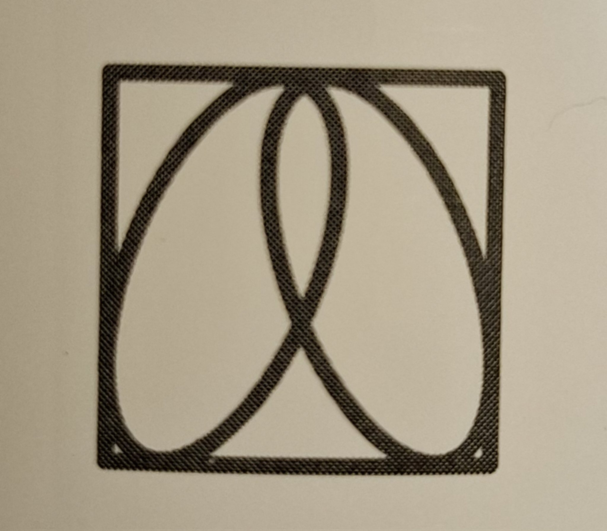
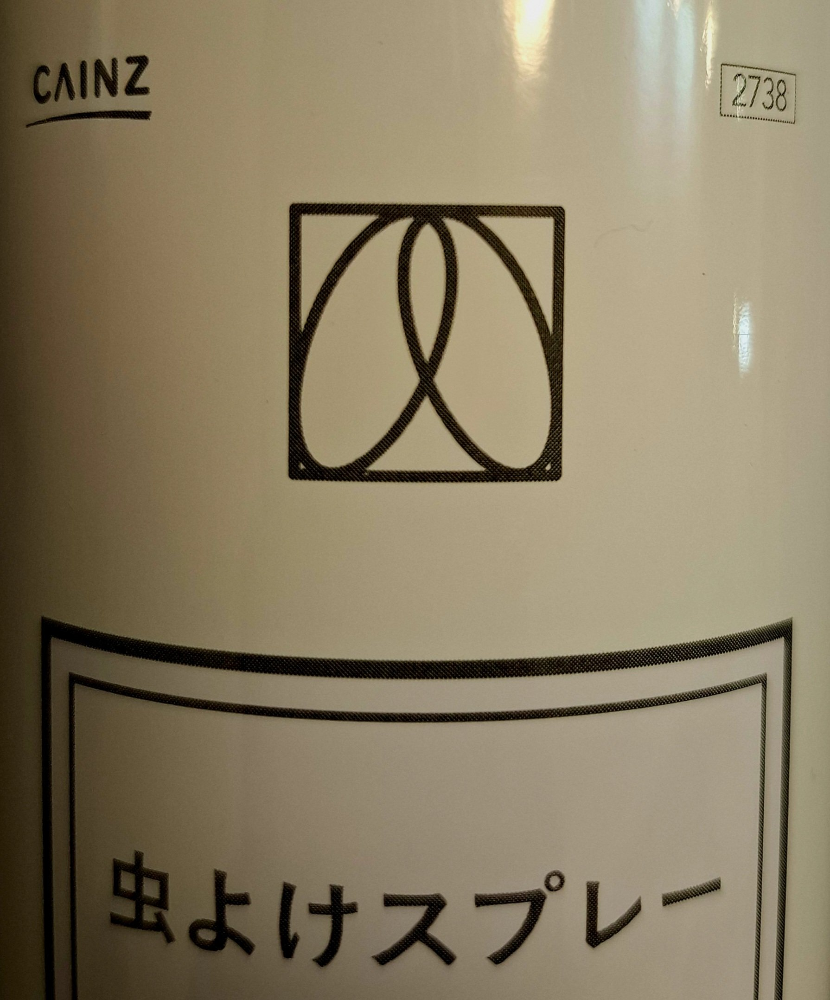

# 🐜 企業が虫除けスプレーにスペアのシジルを使用（2025年8月7日）

2025年8月、日本某所で販売された虫除けスプレーのラベルに、  
**オースティン・オスマン・スペア（Austin Osman Spare）のシジル魔術に酷似した図像**が使用されていることが、  
ディスコーディアン歴13年7ヶ月のKSC氏によって発見されました。

   
 

 

この偶然の一致、あるいは意図的な魔術的転用に対し、X（旧Twitter）上では以下のような反応が寄せられています。

> KSC殿のケイオスグレネードがぶち当たった瞬間💣💥🤣  
> 日本で起こったディスコーディアン案件を追加するなり  
> 方法はなんでもいいので、何かの形で残して置いてほしいです🌠

さらに、ravensgate氏はグラント・モリスンの「POP MAGIC!」に言及し、  
「企業がシジルを使うこと」それ自体が魔術的事例であると指摘。  
このスプレー事件は「企業×魔術（シジル）」の鮮烈な実例として、**国内POP MAGICの記録**にも刻まれることになりました。

---

[ディスコーディアン魔術アーカイブ](https://github.com/ravensgate-tux/Discordianism_ksc/blob/main/README.md)

---

> 🗃 本事例は「企業によるシジルの転用」カテゴリに分類され、アーカイブに永遠に保管される見込みです。

> 🌀 混沌は商品ラベルの中にも現れる。

