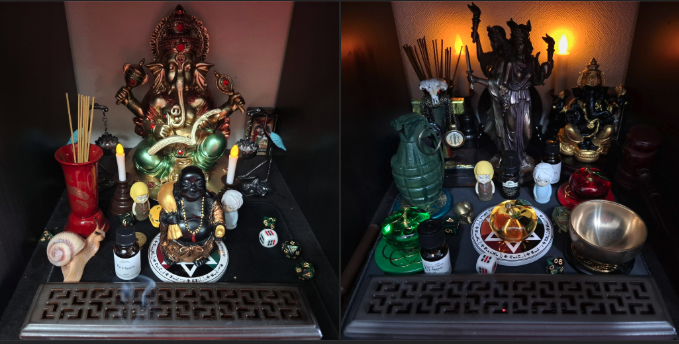

# 🍏 本棚神殿のススメ　（The Bookcase Temple Recommendation）

 
This page is maintained by ravensgate (KSC) a.k.a. Le Sorcier Inconnu.

## はじめに
海外の西洋儀式魔術は広い空間や多人数の参加を前提にすることが多いですが、
日本では住環境の都合から、個人で行う日拝や供物、祈り、儀式においては
**小さな空間を活用する工夫**が求められます。

その一つの答えが「本棚神殿」です。  
仏壇のようなスケールで構築でき、電池式蝋燭を使えば安全性も確保できます。

---

## 本棚神殿とは？
- 本棚や収納の一角を利用して設置する小規模な神殿
- 日拝、供物、祈り、儀式などを個人で行える
- 煙や火のリスクを避けるため、電池式蝋燭やインセンスを活用できる

実例として、私は以下の3種類を分けて用意しています：
- ディスコーディアニズム神殿
- ケイオスマジック神殿（シジル魔術、だるま魔術）
- 緊急事態用の「常世送り」神殿

---

## 構築の考え方
本棚神殿の構築には、TSS（Strategic Sorcery）で学んだことをベースにしましたが、
必ずしもそれにこだわる必要はありません。

- 自分に関連する象徴を置いても良い
- 伝統的な神像や道具を用いても良い
- 自作が理想だが、市販品を使うのも十分有効

> ジェイソン・ミラー曰く：  
> 「小学生の工作のような魔法武器を使うくらいなら市販品を買え」

---

## 実践と効果
本READMEでは、聖別や詳細な儀式手順には触れません。  
しかし、日々のお香・祈り・感謝を捧げる実践を続けることで、
**空間そのものが力を宿す**ようになります。

---

## 結論
「本棚神殿」は、日本の生活様式に適した実践的な魔術空間です。  
小規模ながらも本格的に儀式を行うことができ、継続的に働きかけることで力を蓄積していきます。

ぜひ、自分自身に合った象徴や道具を組み合わせ、
自分だけの「本棚神殿」を構築してみてください。

---

© 2025 知られざる呪術師（Le Sorcier Inconnu）  
本ドキュメントは [Creative Commons BY-SA 4.0](https://creativecommons.org/licenses/by-sa/4.0/deed.ja) に基づき公開されています。
