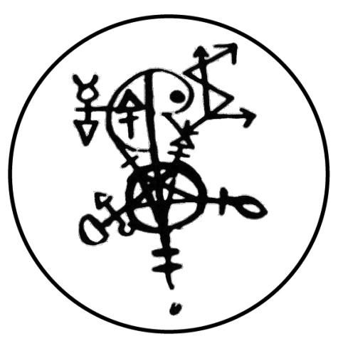
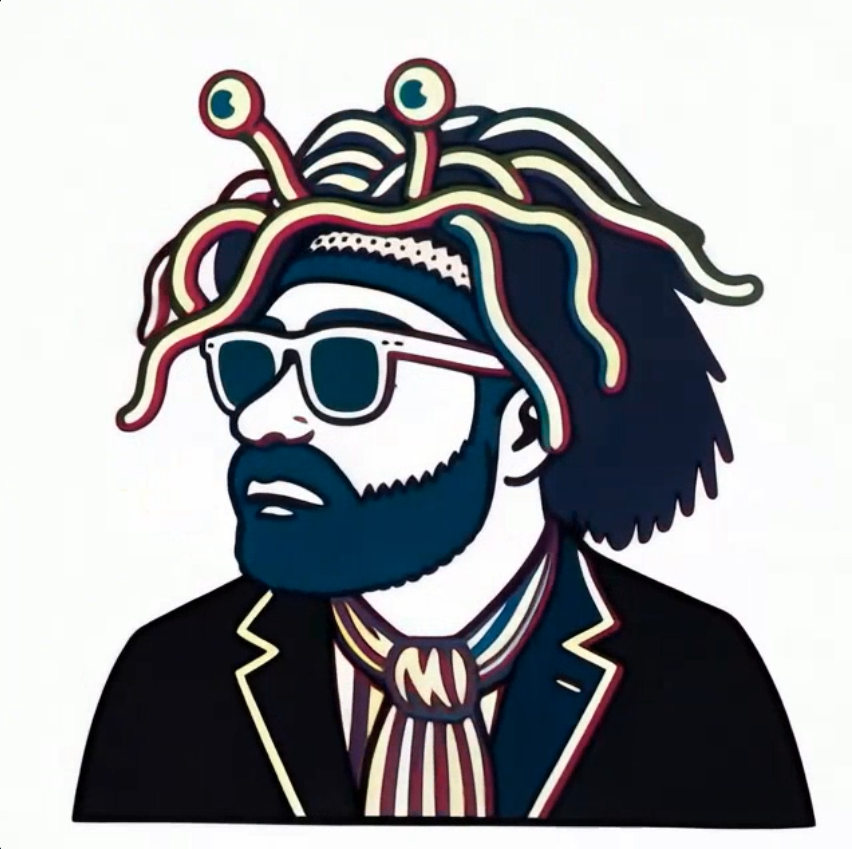

# A Preliminary Calling to 663

 
doo

## (Doombringer Working)

 
This page is maintained by ravensgate (KSC) a.k.a. Le Sorcier Inconnu.</vr> 
著者のKSCこと「知られざる呪術師」は ドロレス・アッシュクロフト=ノーウィッキから直接第３位界のイニシエーションを受け ダイアン・フォーチュンから続く法脈を受け継いでいる。

------------------------------------------------------------------------

## 1. 概要

この儀式は、663のシジルを用いた予備的召喚ワークです。
ここで「Doombringer」と呼ばれる存在（または象徴的原理）への接触を目的とします。

形式はシジル魔術の構造に基づいており、

-   呼びかけ
-   門の開示宣言
-   集中（ノーシス）
-   終結句

という流れで構成されています。

------------------------------------------------------------------------

## 2. 必要なもの

-   663のシジル（正位置で前方に設置）
-   祭壇（象徴物は任意、簡素でも可）
-   黒または白の蝋燭 1本（中央に配置し点火）
-   チャイムまたはベル
-   聖杯（飲み物を入れる）
    またはパイプ等（吸引媒体）※任意

------------------------------------------------------------------------

## 3. 準備

1.  祭壇を整える。
2.  663のシジルを正面に置く。
3.  蝋燭に火を灯す。
4.  シジルに向かって座る（または立つ）。
5.  呼吸を落ち着かせ、意識を一点に集める。

------------------------------------------------------------------------

## 4. The Rite

### Opening Invocation

> Hear me and allow my trespass
> O Ancient Absurdity. He who initiates the seeking
> For I am such, and ask of you The Knowledge.

*(Strike chime once.)*

------------------------------------------------------------------------

### Declaration of Entry

> Know that I am humble and willing
> And tread without fear into your hallowed domain
> The gate is open, the path is drawn.

*(Strike chime once.)*

------------------------------------------------------------------------

### Affirmation

> The gate is open, the path is drawn!

*(Strike chime once.)*

------------------------------------------------------------------------

### Gnosis Phase

-   Gaze intently upon the 663 sigil.
-   Maintain fixed attention.
-   Drink from the chalice, or inhale from the pipe.

When intensity peaks:

> The gate is open! Neer-may Co-mooh Rem-got Bed.

*(Strike final chime.)*

------------------------------------------------------------------------

## 5. 終了

-   静かに蝋燭を消す
-   すぐに会話をしない
-   必要であれば印象や体験を記録する

------------------------------------------------------------------------

## 6. 補足（構造理解）

この儀式は典型的なシジルワークの形式を持っています。

-   宣言 → 強化 → 集中 → 放出
-   チャイムは意識の段階を区切るアンカーとして機能します
-   最後の語句は意味を持たない聖語（バーバリア・ノミナ）として機能します

---

こちらもご覧ください➡️[ディスコーディアン魔術アーカイブ](https://github.com/ravensgate-tux/Discordianism_ksc/blob/main/README.md)

---
© 2025 知られざる呪術師（Le Sorcier Inconnu）  
本ドキュメントは [Creative Commons BY-SA 4.0](https://creativecommons.org/licenses/by-sa/4.0/deed.ja) に基づき公開されています。
