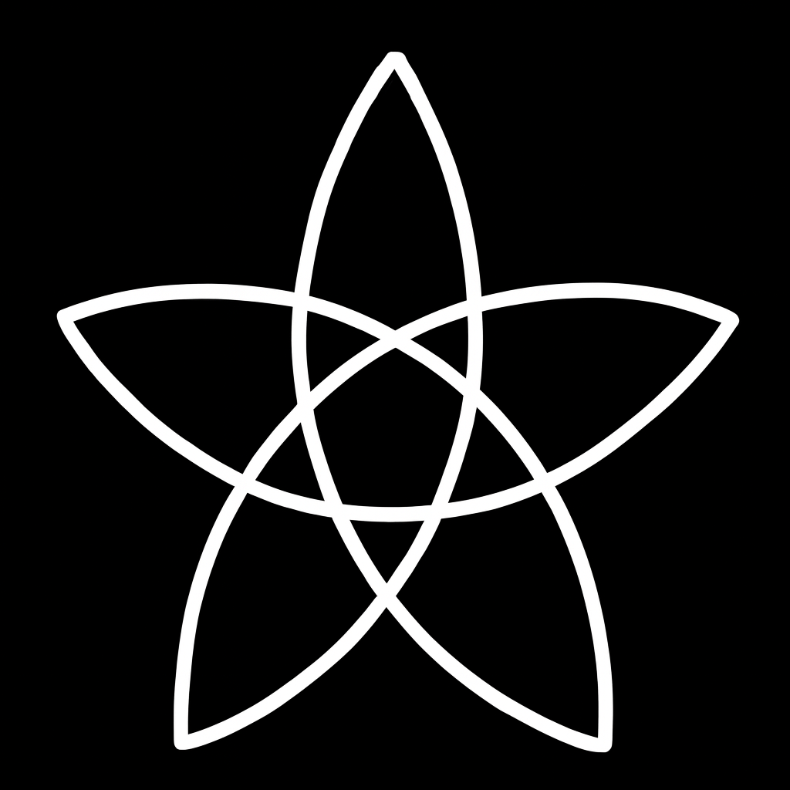

# Eris五芒星による視覚化トレーニング

## 準備
1. 暗めの部屋で、下のEris五芒星の画像を明るいディスプレイや紙で用意する。
2. 白い壁や無地の白いボードを背景として使えるようにする。
 

 

 

## 手順
1. **凝視**  
   図形の中央付近（交差点）を**瞬きせず**30〜60秒ほど見つめる。  
   視界の端の動きや色の変化は無視して、意識を図形に集中。

2. **目を閉じる / 視線を移す**  
   - 目を閉じるか、すぐに白い壁を見つめる。
   - 図形が補色（白→黒、黒→白）で残像として現れる。

3. **残像を維持**  
   - 呼吸を落ち着け、残像が消えそうになっても意識で形を「なぞる」ように維持する。
   - 消えたら再度目を開け、手順を繰り返す。

4. **視覚化への移行**  
   - 慣れてきたら、残像が消えたあとも**自分の意志で像を再構築**。
   - 図形の色を変えたり、奥行きをつけたりして自由に操作してみる。

## 効果
- **視覚化持続時間の延長**（魔術儀式や瞑想で重要）
- 集中力の向上
- 図形をアストラルゲートとして利用する感覚の習得
