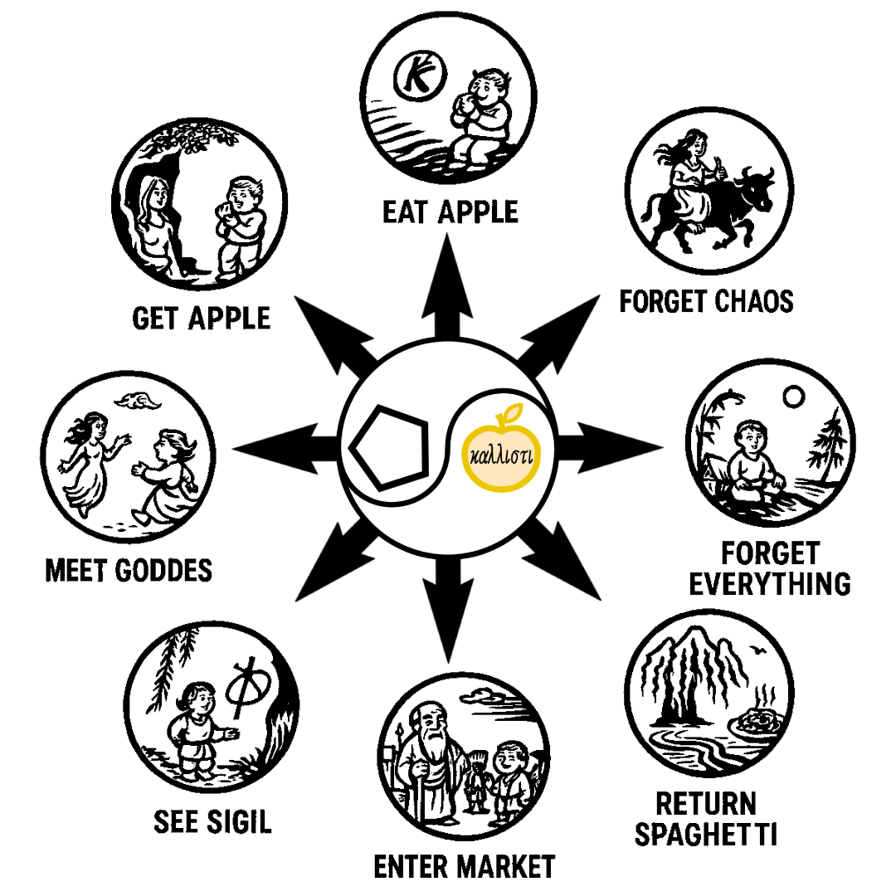

# 🍏 LIBER SPAGHETTI
*A Chaos Magickal Grimoire of Noodles and Nonsense*

 

---

## Book I – Liber Nullius (The Null Noodle)
**Theoretical Foundations of Pasta and Chaos**
1. **Preface to the First Dish** – Why Pasta, Why Now, and Why Not Rice?
2. **On the Nature of Chaos and Pasta** – The Infinite Boiling Water and the Forms It Conceals.
3. **Neither Sauce nor Sauce-less** – The Doctrine of Neither-Neither-Al-Dente.
4. **Entropy and the Cold Spaghetti Principle** – All Rituals Tend Toward Leftovers.
5. **Symbols of the Spaghetti Current** – From Fork Sigils to Noodle Knots.

---

## Book II – Liber Macaronicus
**The Rites of the Holy Spaghetti**
6. **The Eight Noodle Stages of Soul Evolution** – Illustrated with Practical Noodle Work.
7. **The Boiling of the Noodles** – Steam Gnosis and the Timing of Initiation.
8. **Sauce Divination** – Reading Omens in Marinara Splash Patterns.
9. **The Spinning Fork of Fate** – Rotational Magic and Vortex Trance.
10. **The Rite of the Bottomless Bowl** – Evocation of Infinite Appetite.

---

## Book III – Psychonoodle
**Mind Games for the Hungry Adept**
11. **Linguini of Light** – Visualisation Exercises Using Endless Pasta Strands.
12. **The Ravioli Gate** – Pathworking Through Stuffed Mysteries.
13. **Pastafarian Paradoxes** – Koans to Collapse Certainty and Encourage Laughter.
14. **The Discipline of the Sauce-Stained Robe** – On Cultivating Sacred Messiness.

---

## Appendices
- **Appendix A:** Glossary of Esoteric Pasta Terms – From *Gnocchi* to *Ziti*.
- **Appendix B:** Sigils of the Pasta Pantheon – Eris, FSM, and Regional Noodle Deities.
- **Appendix C:** Field Manual for Guerrilla Pasta Rituals – How to Perform Rites in Public Without Getting Arrested.
- **Appendix D:** The Discordian Noodle Calendar – Feast Days, Fast Days, and Half-Boiled Wednesdays.
