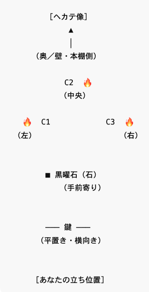

# ヘカテのためのオスタラの儀式（SOL風）
Hail to Thee, Hecate — An Ostara Rite (SOL / Dolores Ashcroft-Nowicki style)
English recitations for actual use. Japanese lines are explanatory/auxiliary.

 
This page is maintained by ravensgate (KSC) a.k.a. Le Sorcier Inconnu.</vr> 
著者のKSCこと「知られざる呪術師」は ドロレス・アッシュクロフト=ノーウィッキから直接第３位界のイニシエーションを受け ダイアン・フォーチュンから続く法脈を受け継いでいる。

---

## 概要 / Overview
この儀式は オスタラ（春分） の時に行う
SOL（Servants of the Light）風の短儀式である。

春分は
光と闇が完全に均衡する時であり
再生した光が世界の中で
実際に成長を始める転換点である。

この儀式ではヘカテを

境界の女神  
季節の門の守護者  
夜から昼への移行を導く松明の女神  

として呼びかける。

Duration: 約15–20分  
Setting: 静かな空間、柔らかい自然光または薄暗い照明

---

## 用意するもの（Materials）

祭壇用クロス（白・淡緑・金など）

ろうそく 3 本：  
黒 → 赤 → 白  

供物：蜂蜜、ミード、またはワイン（少量）

象徴物：  
卵、小さな花、または芽吹いた枝（任意）

マッチ／ライター  
耐火皿  
消火用の蓋  

※ 火気の扱いには十分注意すること
  
---

## 配置（Arrangement）

- 蝋燭は三角形に配置する  
  - 頂点は術者側ではなく奥  
  - 中央の蝋燭はやや奥  
- 鍵は平置き・水平に、手前  
- 石は蝋燭と鍵の間  
- ヘカテ像や図像がある場合は、蝋燭のさらに奥に置く  

※ 魔法円や追儺の儀式は必要ない  
※ 象徴物の配置は東に向けなくても良い

 

  ---

## Structure / 儀式の流れ

### I. Opening the Temple
（神殿を開く）

東を向いて立ち、呼吸を整える。

I open the Temple within and without.
（内なる神殿と外なる神殿を開く）

By the balance of night and day,  
by the turning of the living earth,  
let this place be made sacred.
（昼と夜の均衡と、大地の巡りによって、ここを聖域とする）

短い沈黙を置き、空間の静けさを感じる。

---

### II. Invocation — Hail to Thee, Hecate
（呼びかけ）

ろうそくを  
黒 → 赤 → 白  
の順に灯す。

Hail to Thee, Hecate Triformis,  
Keeper of the Turning Ways,  
Lady of the Balanced Light.
（三相の女神ヘカテよ、巡りゆく道の守護者よ、均衡の光の女主人よ）

At the meeting of night and day,  
when the earth awakens to the growing light,  
I call upon Thee.
（昼と夜が出会うこの時、大地が成長する光に目覚めるこの時、あなたを呼びます）

Stand beside me at the gate of the season,  
and guide my steps with quiet wisdom.
（この季節の門にて共に立ち、静かな叡智で私を導きたまえ）

沈黙。

---

### Offering and Reflection
（奉献と内省）

供物に手を添え、静かに唱える。

Hail to Thee, Lady of the Threshold —  
I offer this in gratitude.
（門の女神よ、感謝をもってこれを捧げます）

The darkness has passed through its turning,  
and the light now walks openly beside it.
（闇は巡りを終え、光は今それと並んで歩む）

In this balance,  
may my path grow clear.
（この均衡の中で、私の道が明らかになりますように）

白い炎を見つめ、  
これから成長させたい  
一つの「種」を心に思い描く。

---

### 4. Closing — Hail and Farewell
（神殿を閉じる）

ろうそくを  
白 → 赤 → 黒  
の順に消す。

Hail and Farewell, Hecate,  
Guardian of the Turning Year.
（敬礼と別れを、巡る年を守るヘカテよ）

I thank Thee for Thy presence  
and the wisdom of the balanced way.
（あなたの臨在と、均衡の道の叡智に感謝します）

The Temple is closed,  
yet the light remaineth within.
（神殿は閉じられた。されど光は内に残る）

So may it be.

深呼吸を数回行い、日常へ戻る。

---

## Notes / 備考

供物は翌朝、自然に還る場所へ。

春分は  
「夜の終わり」ではなく  
光と闇の均衡の始まりである。

この儀式では  
何かを強く願うよりも  
自分の進む方向を静かに整えることを重視する。

---

こちらもご覧ください➡️[ディスコーディアン魔術アーカイブ](https://github.com/ravensgate-tux/Discordianism_ksc/blob/main/README.md)

---
© 2025 知られざる呪術師（Le Sorcier Inconnu）  
本ドキュメントは [Creative Commons BY-SA 4.0](https://creativecommons.org/licenses/by-sa/4.0/deed.ja) に基づき公開されています。

