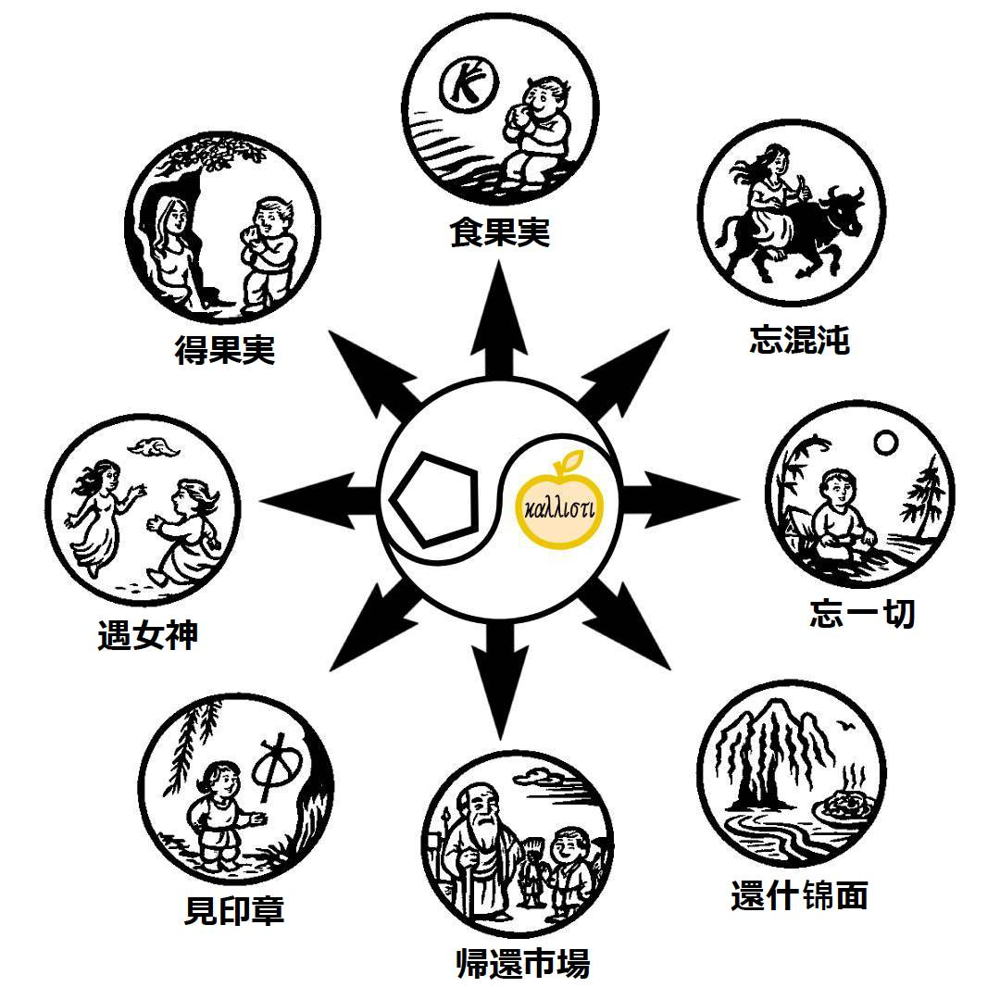
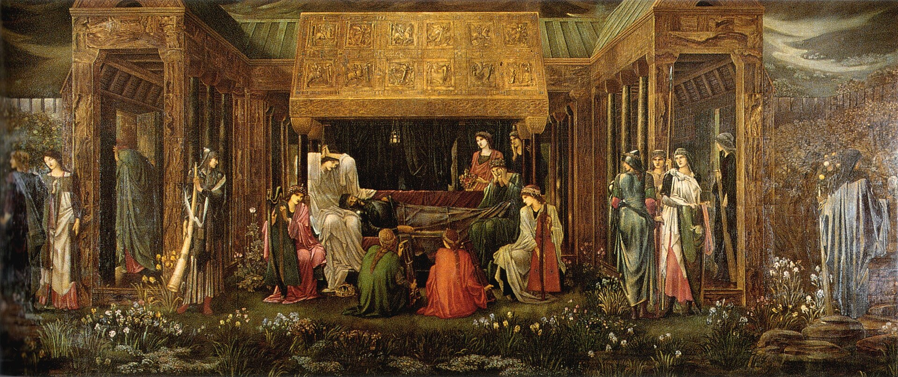
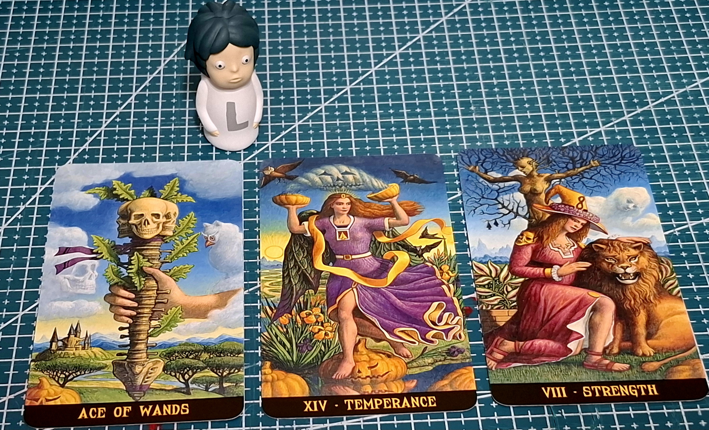
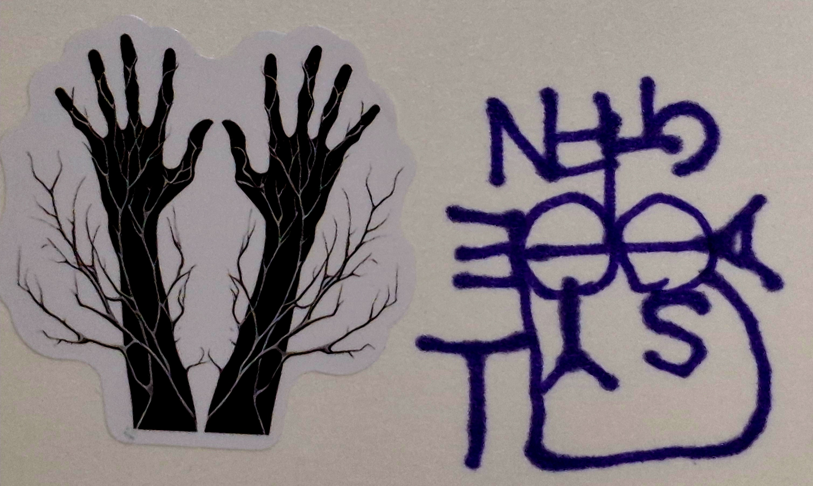
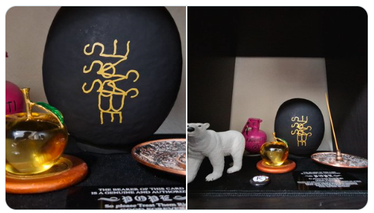
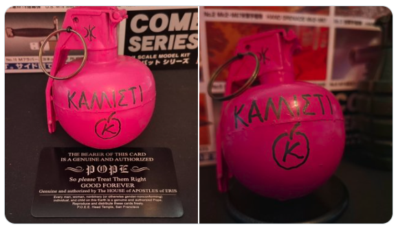
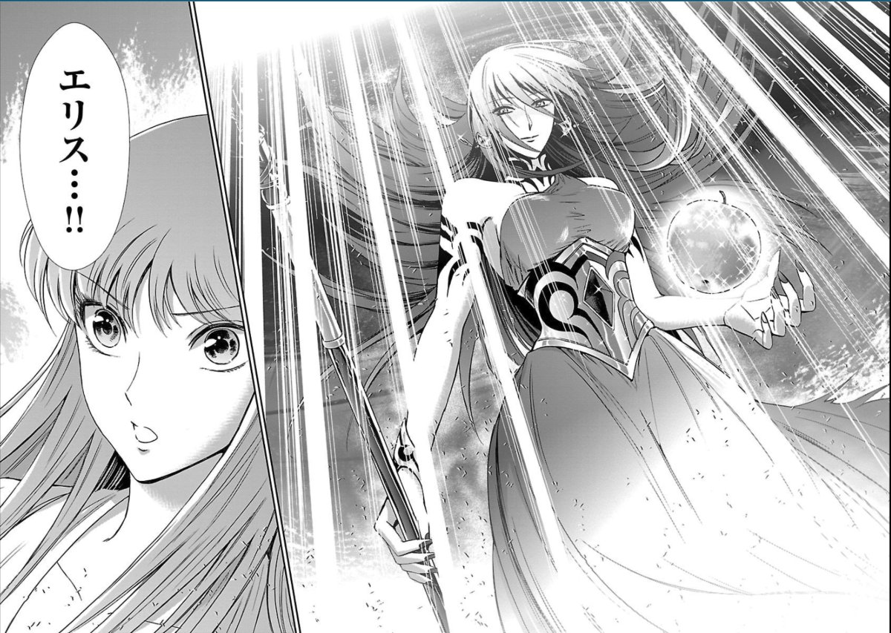

# 🍏 ディスコーディアン魔術アーカイブ🇯🇵

[English site is here!🇬🇧](https://github.com/ravensgate-tux/Discordianism_ksc-en/blob/main/README.md) 
ようこそ、「ディスコーディアン魔術アーカイブ」へ
このリポジトリは、エリス女神とPOEEの精神を受け継ぎ、
Keepers of Sacred Chao（KSC：聖なる混沌の守護者）による実践・研究・創作を記録・共有するためのものです。

 
This page is maintained by ravensgate (KSC) a.k.a. Le Sorcier Inconnu.

<a href="https://github.com/ravensgate-tux/spareA-spareB/blob/main/README.md">
KSC氏の最新の論文（英語）「スペアって2人居るんじゃないの？(Spare A vs Spare B 仮説)」はこちら
</a>

 

---

8方向によるディスコーディアン魂の循環図（聖杯＝黄金のりんごの探求） 

 

 

魔術師🧙は、ゾス(Zos)の境界が溶けてキア(Kia)の門が開くまで、シジル(Sigil)を見つめます。するとその隙間から、笑う女神Eris🍏が現れ、リンゴを手渡します。その知恵の実🍎を食べると、混沌🌀を体験し、 そして混沌さえ忘れ、ついにすべての空虚を体験し、最終的にナイザー＝ナイザー(Neither-Neither)に至ります。しかしこの悟りは終わりではなく、魔術師はスパゲッティ🍝とワイン🍷、地上の喜び、自己愛へと回帰します。そしてキア(Kia)のfnord味をかみしめ、ディスコーディアのパスタと絡み合いながら、魔術師は、また市場に戻って🐃他者を導くのです。

ディスコーディアン🍏にとっての聖杯🏆それは「芸術」である🧙‍♂️ 

そしてアーサー王が眠るアヴァロンの島は、ケルト語で「黄金の林檎の島」と呼ばれる （出典：ジョセフ・キャンベル『聖杯の神話』） 

  
## 📡 最新のニュース

- [ 💻 Class → Instance 設計：現代魔術における安全な象徴運用のための設計原則（2025年12月29日）](https://github.com/ravensgate-tux/Discordianism_ksc/blob/main/class-to-instance.md)
- [ 🐝 SOL風ヘカテ神殿でユールの儀式をリリース（2025年12月14日）](https://github.com/ravensgate-tux/Discordianism_ksc/blob/main/Hecate_Yule_SOL.md)

- [🗝️ Hekate チャント・ガイドブック（2025年11月29日）日(https://github.com/ravensgate-tux/hekate-chants/blob/main/README.md)
  
- [🧙‍♂️ ヒカルランドから新刊出版のお知らせ：シジル魔術の創始者スペアの 『快楽の書』『ゾスの呪詛』（2025年11月16日）](https://www.amazon.co.jp/%E3%82%B7%E3%82%B8%E3%83%AB%E9%AD%94%E8%A1%93%E3%81%AE%E5%89%B5%E5%A7%8B%E8%80%85%E3%82%B9%E3%83%9A%E3%82%A2%E3%81%AE-%E3%80%8E%E5%BF%AB%E6%A5%BD%E3%81%AE%E6%9B%B8%E3%80%8F%E3%80%8E%E3%82%BE%E3%82%B9%E3%81%AE%E5%91%AA%E8%A9%9B%E3%80%8F-%E3%82%AA%E3%83%BC%E3%82%B9%E3%83%86%E3%82%A3%E3%83%B3%E3%83%BB%E3%82%AA%E3%82%B9%E3%83%9E%E3%83%B3%E3%83%BB%E3%82%B9%E3%83%9A%E3%82%A2/dp/4867425710/ref=sr_1_3?dib=eyJ2IjoiMSJ9.InZD-2DTzoirFwcQvYAHEg.DCeKpuSucbevzNO2bMcUt3o9h1pUGJ5SXLRohlqx0eY&dib_tag=se&qid=1763304390&s=books&sr=1-3&text=%E7%9F%A5%E3%82%89%E3%82%8C%E3%81%96%E3%82%8B%E5%91%AA%E8%A1%93%E5%B8%AB)

 

- [ 🐝 SOL風ヘカテ神殿でのサムハインの儀式をリリース（2025年10月21日）](https://github.com/ravensgate-tux/Discordianism_ksc/blob/main/Hecate_Samhain_SOL.md)
- [⛩️🦊 Inari Rite of Longevity and Prosperity（2025年10月11日） ](https://github.com/ravensgate-tux/Discordianism_ksc/blob/main/Inari_Rite_of_Longevity_and_Prosperity.md)
- [🎵シャーウィンのエングラム魔術をリリース（2025年10月9日）](https://github.com/ravensgate-tux/Discordianism_ksc/blob/main/sherwin-engram-magick-ja.md)
- [🧙‍♂️ SOL（Servants of the Light）の儀式体系と霊的教育構造をリリース（2025年10月7日）](https://github.com/ravensgate-tux/Discordianism_ksc/blob/main/SOL_TSS_lineage.md)
  
- [🍏 Transitus Fluvii（川を渡る者）を使用したシジル生成法 Backlandの書籍より更新（2025年10月4日）](https://github.com/ravensgate-tux/passing_river/blob/main/README.md)

- [🧙‍♀️ 九つの結び目の呪文（Nine Knots Spell）リリース（2025年10月3日）](https://github.com/ravensgate-tux/Discordianism_ksc/blob/main/nine_knots_spell.md)
- [🍏 日本ディスコーディアン協会公式ホームページをリリース（2025年9月29日）](https://www.discordianism-society-japan.com/%E3%83%9B%E3%83%BC%E3%83%A0)
- 🎃 大いなる秘技「かぼちゃ🎃リーディング」の運用開始（2025年9月24日）究極の秘技のため公開はされない
  

 

- [🍏 ディスコーディアン暦のWikipedia日本語版をリリース（2025年9月24日）](https://ja.wikipedia.org/wiki/%E3%83%87%E3%82%A3%E3%82%B9%E3%82%B3%E3%83%BC%E3%83%87%E3%82%A3%E3%82%A2%E3%83%B3%E6%9A%A6)
- [🐝 観察と再創造ワーク／ドロレス方式（2025年9月23）](https://github.com/ravensgate-tux/Discordianism_ksc/blob/main/dolores-observation.md)

- [🏰 記憶の宮殿ワーク／ハービー・ブレナン方式 (2025年9月23日)](https://github.com/ravensgate-tux/Discordianism_ksc/blob/main/brennan-mindpalace.md)

- [🏰 お城を使ったパスワーキング前の清掃🧹🪣作業（2025年9月23日）](https://github.com/ravensgate-tux/Discordianism_ksc/blob/main/castle_clean.md)

- [🎲 サイコロ視覚化トレーニングをリリース（2025年9月21日）](https://github.com/ravensgate-tux/Discordianism_ksc/blob/main/%E3%82%B5%E3%82%A4%E3%82%B3%E3%83%AD%E8%A6%96%E8%A6%9A%E5%8C%96%E3%83%88%E3%83%AC%E3%83%BC%E3%83%8B%E3%83%B3%E3%82%AF%E3%82%99.md)

- [🐝 W・E・バトラーのWikipedia日本語版リリース（2025年9月18日）](https://ja.wikipedia.org/wiki/W%E3%83%BBE%E3%83%BB%E3%83%90%E3%83%88%E3%83%A9%E3%83%BC)

- [🌀 ライオネル・スネルのWikipedia日本語版リリース（2025年9月18日）](https://ja.wikipedia.org/wiki/%E3%83%A9%E3%82%A4%E3%82%AA%E3%83%8D%E3%83%AB%E3%83%BB%E3%82%B9%E3%83%8D%E3%83%AB)

- [🐐 フィル・ハインのWikipedia日本語版リリース（2025年9月18日）](https://ja.wikipedia.org/wiki/%E3%83%95%E3%82%A3%E3%83%AB%E3%83%BB%E3%83%8F%E3%82%A4%E3%83%B3)

- [🍏 ディスコーディアニズムのWikipedia日本語版リリース（2025年9月17日）](https://ja.wikipedia.org/wiki/%E3%83%87%E3%82%A3%E3%82%B9%E3%82%B3%E3%83%BC%E3%83%87%E3%82%A3%E3%82%A2%E3%83%8B%E3%82%BA%E3%83%A0)
  
- [🍏 ブラックミラー（W.E.バトラー準拠）制作および使い方リリース (2025年9月15日)](https://github.com/ravensgate-tux/Discordianism_ksc/blob/main/black_mirror_manual.md)

- [🍏 タロット・タリスマン（改）手順書リリース (2025年9月14日)](https://github.com/ravensgate-tux/Discordianism_ksc/blob/main/tarot_talisman_modified.md)

- [🏰 ギレルモ・デル・トロ監督映画作品でのパスワーキング (2025年9月11日)](https://github.com/ravensgate-tux/Discordianism_ksc/blob/main/deltoro_pathworking.md)

- 🍏 スペア漫画：SPARE AND CATS 配信開始（2025年9月1日）
  

 

- [🍏 本棚神殿のススメ（2025年9月10日）](https://github.com/ravensgate-tux/Discordianism_ksc/blob/main/BookshelfTemple.md)

- [🏰 アーサー王象徴体系でのパスワーキング・ビアズリー挿絵版 (2025年9月7日)](https://github.com/ravensgate-tux/Discordianism_ksc/blob/main/king_Arthur_path.md)

- [🏰 ディスコーディアン映画ライブラリーに『モンティ・パイソン・アンド・ホーリー・グレイル』がエントリー(2025年9月6日)😆](https://ja.wikipedia.org/wiki/%E3%83%A2%E3%83%B3%E3%83%86%E3%82%A3%E3%83%BB%E3%83%91%E3%82%A4%E3%82%BD%E3%83%B3%E3%83%BB%E3%82%A2%E3%83%B3%E3%83%89%E3%83%BB%E3%83%9B%E3%83%BC%E3%83%AA%E3%83%BC%E3%83%BB%E3%82%B0%E3%83%AC%E3%82%A4%E3%83%AB)

- [🍏 2分でわかるディスコーディアニズム（2025年9月4日）](https://www.youtube.com/watch?v=dFjaCGx6g5Y)
- 🍏 非定期：りんご新聞発行開始（2025年9月1日）

 

 

- [🍏 だるま魔術 ver.1（2025年8月31日）](daruma-magic-jp.md)
- [🍏 POEE祭司のno+eへのリンクを開始（2025年8月31日）](https://note.com/tramal)
- [🍏 重複文字を消さないAOS流シジル作成（2025年8月29日）](https://github.com/ravensgate-tux/sigil_duplicates/blob/main/README.md)
- [✏️英語圏レポート：シジル作成時の重複文字の削除についての調査結果をリリース（2025年8月29日）](https://github.com/ravensgate-tux/Discordianism_ksc/blob/main/chaos_sigils_letter_elimination.md)

 

- [🌀 だるま魔術 ver.1 - Daruma Sigilリリース - English (2025年8月26日)](https://github.com/ravensgate-tux/daruma_sigil/blob/main/README.md)

 

- [📺 知られざる呪術師のチャンネル - YouTube発表 (2025年8月24日) ](https://www.youtube.com/@ravensgate-v5s)
- [🍏 LIBER SPAGHETTI🍝 出版発表（2025年8月15日）](https://github.com/ravensgate-tux/Discordianism_ksc/blob/main/LIBER_SPAGHETTI_TOC.md)
- [🍏 エリス神関連儀式をリリース（2025年8月9日）〜](https://github.com/ravensgate-tux/Discordianism_ksc/blob/main/README.md#R01)
- [🐜 企業が虫除けスプレーにスペアのシジルを使用（2025年8月7日）](2025-08-07_sigil_spray.md)

- 🍎 ピンクのケイオスグレネードが登場! (July 29, 2025)

 
<ul>
  <li>🐐 <a href="https://enfolding.org/out-now-delinquent-elementals/">新しい本が出た! Phil Hine! (Mar 25, 2025)</a></li>
</ul>

## 📜 基本理念
このプロジェクトは、フィル・ハイン『Prime Chaos』第4章の定義をベースに、
ディスコーディアニズム（Discordianism）の哲学、実践、儀式、魔法武器などを日本語で整理・発展させていくことを目的とします。

- 🇯🇵 [日本ディスコーディアン協会](https://x.com/discordianjp)
- 🐐 [ディスコーディアニズム（Phil Hine）](https://github.com/ravensgate-tux/sorcier_catalogue/blob/main/README.md#PHH01)
- 🐐 [現代シャーマニズムの技法 (Phil Hine)](https://github.com/ravensgate-tux/hine_modern_shamanism/blob/main/README.md)
- 🐐 [喚起魔術の技法 (Phil Hine)](https://github.com/ravensgate-tux/hine_evocation/blob/main/README.md)
- 🐐 [ケイオスマジック (Phil Hine)](https://github.com/ravensgate-tux/sorcier_catalogue/blob/main/README.md#PHH00)
- 🕶 [POP MAGIC! (グラント・モリスン)](https://github.com/ravensgate-tux/pop_magic_annotation/blob/main/README.md)
- 🕶 [BATMAN R.I.P. (グラント・モリスン)](https://github.com/ravensgate-tux/batman_rip_zine/blob/main/README.md)
- 🌀 [アーティスト・マジック (DKMU文書)](artist_magic.md)

<ul>
  <li>🌀 <a href="https://www-principiadiscordia-com.translate.goog/book/1.php?_x_tr_sl=en&_x_tr_tl=ja&_x_tr_hl=ja&_x_tr_pto=wapp">Principia Discordia (official) - 🇯🇵 Google翻訳版</a></li>
</ul>

## 🌀 ディスコーディアニズムとは
- 混沌とユーモアを中心に据えた現代魔術の一形態
- 崇拝対象はギリシャ神話の争いの女神「エリス」

 
画像参照：『聖闘士星矢 セインティア翔』by 車田正美（原作）and 久織ちまき（漫画）  

 

- 秩序や権威に対する挑戦を通じて、新しい視点と創造的混乱を生み出す

[ディスコーディアばんざい！(Hiro氏)- Oven-Ready Chaosの第5章〜](https://occultlibrary.wiki.fc2.com/wiki/%E3%81%99%E3%81%90%E3%82%8F%E3%81%8B%E3%82%8B%E6%B7%B7%E6%B2%8C%E9%AD%94%E8%A1%93%203)

[(Oven-Ready Chaos英語原本)](https://github.com/ravensgate-tux/Discordianism_ksc/blob/main/Oven-Ready-Chaos-Phil-Hine-1992-1997.pdf)

>上記のOven-Ready Chaosの英語原本はPhil Hineが1992年にオンラインで無償配布したテキスト（version 1.3）です。
>ただし、明確な自由利用ライセンスや著作権放棄の宣言はなく、著作権は著者に帰属しています。

## R01

## 🔨 「行」と「儀式」 by 日本ディスコーディアン協会魔術ラボ

ここでは、KSCとして行うディスコーディアン的「行動」や「儀式」について実践例や手順をまとめていきます。
例：
- [🏰 ギレルモ・デル・トロ監督映画作品でのパスワーキング (2025年9月11日)](https://github.com/ravensgate-tux/Discordianism_ksc/blob/main/deltoro_pathworking.md)
- [🏰 アーサー王象徴体系でのパスワーキング・ビアズリー挿絵版 (2025年9月7日)](https://github.com/ravensgate-tux/Discordianism_ksc/blob/main/king_Arthur_path.md)
- [🐝 観察と再創造ワーク／ドロレス方式（2025年9月23）](https://github.com/ravensgate-tux/Discordianism_ksc/blob/main/dolores-observation.md)
- [🏰 記憶の宮殿ワーク／ハービー・ブレナン方式 (2025年9月23日)](https://github.com/ravensgate-tux/Discordianism_ksc/blob/main/brennan-mindpalace.md)
- [🏰 お城を使ったパスワーキング前の清掃🧹🪣作業（2025年9月23日）](https://github.com/ravensgate-tux/Discordianism_ksc/blob/main/castle_clean.md)
- 🧁 Smartie Ritual（楽しい混乱を街へ）
- 🎲 ダイスを使った決定行動
- [🎲 サイコロ視覚化トレーニングをリリース（2025年9月21日）](https://github.com/ravensgate-tux/Discordianism_ksc/blob/main/%E3%82%B5%E3%82%A4%E3%82%B3%E3%83%AD%E8%A6%96%E8%A6%9A%E5%8C%96%E3%83%88%E3%83%AC%E3%83%BC%E3%83%8B%E3%83%B3%E3%82%AF%E3%82%99.md)
- [😂 バニッシュメントとしての笑いの儀式](hotei_laughter.jpg)
- 🃏 儀式魔術 (タロット・タリスマン or シジル) and/or (エゴハンマー or ケイオスグレネード)
- [🍏 エリス神召喚儀式 (English)をリリース（2025年8月12日）](ritual_invoking_eris.md)
- [🐝 SOL風：エリス神 Power of One 内的ワークをリリース（2025年8月11日）](ritual_power_of_one_ish.md)
- [🍏 Transitus Fluvii（川を渡る者）シジル生成法をリリース（2025年8月10日）](https://github.com/ravensgate-tux/passing_river/blob/main/README.md)
- [🍏 Eris五芒星による視覚化トレーニング法をリリース（2025年8月9日）](Eris_pentacle_visualization_training.md)
- [🍏 ディスコーディアン林檎融化法をリリース（2025年8月8日）](apple_melting_contemplation_of_eris.md)
- [🍏 ディスコーディアン林檎観瞑想法をリリース（2025年8月7日）](discordian_apple_contemplation.md)
- [🍏 エリス神小五芒星追儺儀式 (English)をリリース（2025年8月6日）](erisian_banishing_ritual.md)

## 🧰 魔法武器一覧
- [**サイコロ（Dice）**：偶然性と選択肢の拡張](https://www.discordianism-society-japan.com/%E9%AD%94%E8%A1%93%E3%83%A9%E3%83%9C)
- [**エゴハンマー（Ego Hammer）**：自己批判と打破](ego_hammer.jpeg)
- [**ケイオスグレネード（Chaos Grenade）**：創造的な混沌の発生](chaos_grenade.jpg)
- **スマーティー・サービター**：儀式的ストリートアート
- **スパイラル・ペンタグラム**：非直線的な魔法陣

## 🧠 哲学的キーワード
- "Nothing is true. Everything is permitted."
- "We are all Popes."
- "If you think this makes no sense, you’re probably right. Hail Eris!"

## 👁‍🗨 編集・参加について
このプロジェクトはふざけながらも真面目にfnord徐々に拡大予定です。
現在は KSC主宰者が中心となって内容を整備していますが、
慣れてきた方から順に `Pull Request` や `Issue` による参加を歓迎します。

---

Hail Eris! All Hail Discordia!

> "真面目はふざけてる。ふざけてるは真面目。"
> — KSC（聖なる混沌の守護者）

---

## その他の文書類

<ul>
  <li>🐐 <a href="https://occultlibrary.wiki.fc2.com/wiki/%E3%81%99%E3%81%90%E3%82%8F%E3%81%8B%E3%82%8B%E6%B7%B7%E6%B2%8C%E9%AD%94%E8%A1%93">すぐわかる混沌魔術 (Phil Hine) - existing translation by others</a></li>
</ul>

- 🗝️ [Hekate チャント・ガイドブック](https://github.com/ravensgate-tux/hekate-chants/blob/main/README.md)
- 🐘 [ガネーシャ・モーフィング (Phil Hine)](https://github.com/ravensgate-tux/hine_ganesha_morphing/blob/main/README.md)
- 🐘 [ガネーシャ神殿での日拝](https://github.com/ravensgate-tux/ganesha_morning/blob/main/README.md)
- 🎨 [地上の地獄 (A.O.Spare)🇯🇵 - 翻訳・注釈 by KSC](https://github.com/ravensgate-tux/earth_inferno/blob/main/README.md)
- 🎨 [半獣神たちの書 (A.O.Spare)🇯🇵 - 翻訳・注釈 by KSC](https://github.com/ravensgate-tux/book_satyrs/blob/main/README.md)
- 🎨 [快楽の書 (A.O.Spare) 🇯🇵 - 翻訳・注釈 by KSC](https://github.com/ravensgate-tux/book_of_pleasure/blob/main/README.md)
- 🎨 [生命の焦点 (A.O.Spare)🇯🇵 - 翻訳・注釈 by KSC](https://github.com/ravensgate-tux/focus-of-life/blob/main/README.md)
- 🎨 [ゾスの呪詛 (A.O.Spare)🇯🇵 - 翻訳・注釈 notes by KSC](https://github.com/ravensgate-tux/Anathema_of_Zos/blob/main/README.md)
  
---

 

## KSC Discordian Magick Archive
**with TRANSLATIONS & NOTES by**  
Keeper of Sacred Chaos (KSC)  

Assembled by His Obliqueness the Rev DrKSC  
on behalf of  
The Committee for Uncontrolled Reality Manipulation  

---

**Approved for misuse in magical circles**

> Give me your chaos, your satire,  
> Your weird masses yearning to hex free,  
> The blessed refuse of your sigil-stained shrines —  
> This Archive always needs more paradox.  

**HAIL ERIS! – καλλιχᾰ – ALL HAIL DISCORDIA!**

(K) 2025 ALL RITES REVERSED  
REPRINT WHAT YOU LIKE, REMIX WHAT YOU CAN’T
