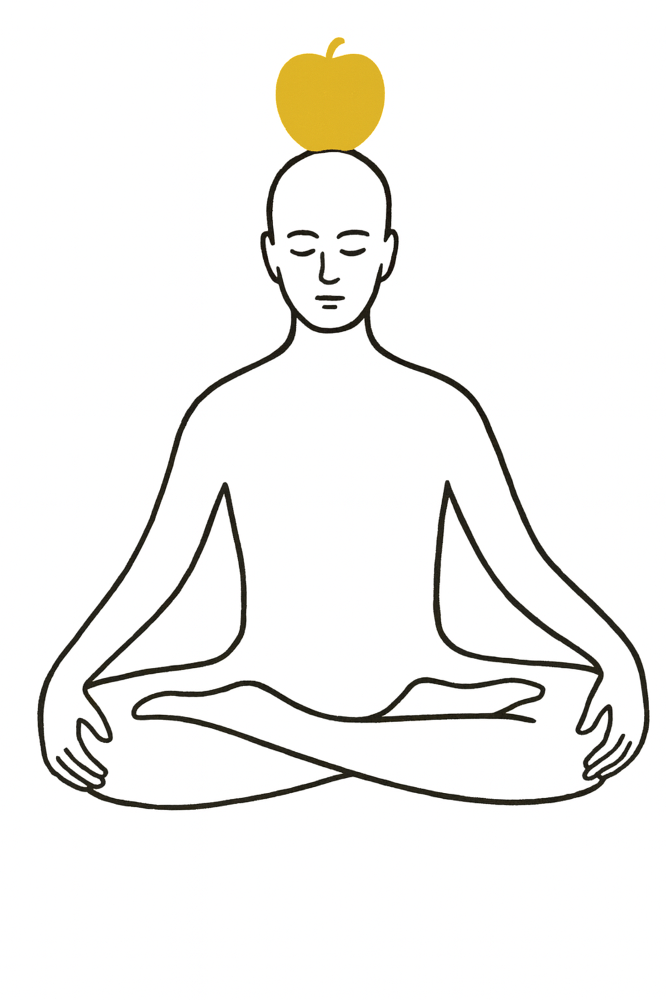

# ディスコーディアン林檎観・融化法（Apple Melting Contemplation of Eris）

## 準備
1. 結果趺坐、半跏趺坐、もしくは無理のない姿勢で座る
2. 背筋を伸ばして呼吸を整える。

 

## 修行手順

### 黄金の林檎を観想
- 頭頂のすぐ上に、光り輝く黄金の林檎が浮かんでいる様子を思い描く。
- 林檎は温かく、内側から金色の光を放っている。

### 林檎が融け出す
- 林檎がゆっくりと溶け始め、黄金の蜜や光が頭頂から体内に流れ込む。
- 最初に脳を満たし、そこから全身へ温かさが広がっていく。

### 全身を包み込む
- 黄金の光は肩、胸、背中、腕、腹、脚へと流れ下り、全身を内側から包み込む。
- 光と蜜が古い考えや執着、固い緊張を溶かしていく。

### 完全な充足
- 体の隅々まで黄金の林檎のエネルギーが行き渡り、自分が一つの黄金の果実になったような感覚を味わう。

### 観想を閉じる
- ゆっくり呼吸を整え、黄金の光を胸の奥に収めるようにして終了する。
- 必要なら「すべてはエリスの御心のままに」と短く唱えて終える。
