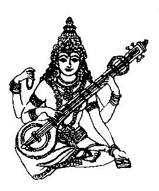
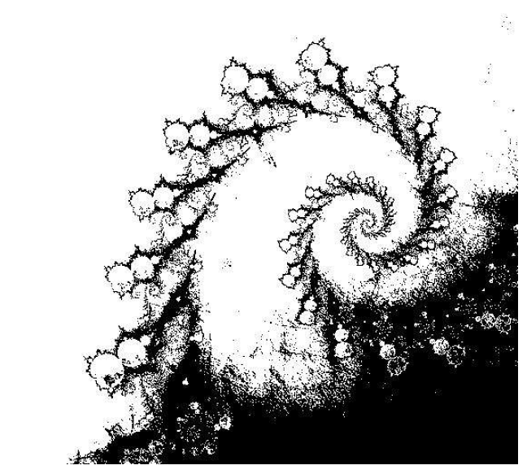
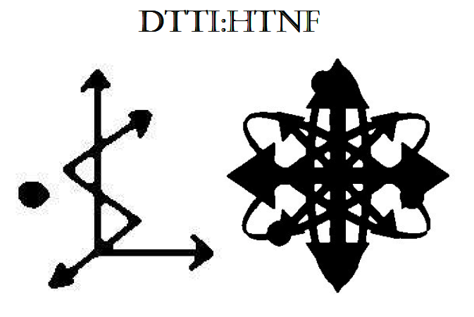

# 🎨 アーティスト・マジック (Artist Magick) — 芸術魔術論

> “This article has been left here in this location as a gift to you.”  
> “It is our wish that you will become inspired by result.”  
> “Make copies, and spread the flame to others.”  
> — DKMU: Domus Kaotica; Marauder Underground

---

 

## 📜 本文（日本語訳）

アーティスト・マジックの目的は、すべての創造行為を、この物質世界に働きかける魔術として機能させることにある。書くこと、描くこと、奏でること──
すべての表現は、魔術的な自己と結びつき、宇宙に向けて意志を純粋に放つものとなるべきである。私たちは、もともと魔術に似た芸術の行為を通して、
意志と物質世界をつなぐ構造を描き出すことができる。細かい筆の動きや独特のクセ、選んだ主題などには、そのアーティストとして生きる者の、最も深い個人的な秘密が表現されている。アーティストは、真実を語るために嘘をつき、嘘をつくために真実を語る──そんな矛盾を生きる存在である。アーティストが表現に魂を込めたとしても、
多くの場合には、それは変容の「金の卵」として神聖視されてしまい、芸術に不慣れな鑑賞者たちによって、ただ崇められてしまう。そのように芸術を消費する人たちにとっては、
表現とは天使や悪魔が踊り狂う舞台でしかない。芸術作品の神々は、非現実的な象徴として舞台に現れ、今ではもう意味がわからない言葉で語り合う。それは、退屈や惰性、画一性に満ちた日常の言葉とはまったく異なっている。

芸術が存在せず、それを生み出そうとする意志さえも消えた社会は、退廃してしまうだろう。芸術は人々を刺激し、人々の情熱に火をつける。お金を使いたいという欲望とは異なる深い衝動を、芸術は心の奥底に呼び起こす。芸術は戦争を引き起こすことも、それを終わらせることもできる。芸術は、愛と憎しみを同時に語る。夢と夢が語り合うように。すべてが不快なのに美しく、意味を持たずに存在している。アーティストは、心の中のブラックホールの横に、パステルカラーの月が昇る庭を出現させるのだ。

そのような世界を生み出せるアーティストでも、窓の外から見える方法だけで行動している。風景は爆発して空と溶け合って、アーティストの手は、最も深く暗い火山の海底にまで届いている。夢の中はアーティストが心地よく過ごせる場所。アーティストの信条は、ひらめきに従って生きること。だから曖昧な価値観ばかりのこの世界において、深い孤独の中で生きていることが多い。 芸術を創造することは、単に生計を立てる手段を提供するだけでなく、人生を変えるような変容を内面に引き起こすことがある。その内部宇宙は、気まぐれや狂気の精神で遊びに来るすべての存在にとっての聖域なのである。残念ながら芸術の魔法は、アーティスト自身の内部世界にあるので、外からは見えないようになっている。

 

オースティン・スペアが象徴的に打ち出したシジルの概念は、芸術という魔術的な現象を考えるうえで、重要な手がかりである。古代エジプトで発展したステラ（碑文）の伝統は、ケネス・グラントによるゾス・キア崇拝（Zos Kia Cultus）にも継承され、絵画を魔術的構造物として捉えるためのひとつの枠組みを示している。魔術師が願望を無意識下に収めることができれば、イメージと意味の相互作用は、筆遣い、色の組み合わせ、線の組み合わせ、メロディーの進行、突発的なノイズの中に埋め込んで、その願望を実現できる可能性がある。優れた芸術的技法に魔法を適用できるアーティストなら、エリス女神への願望を込めたシジル魔術をチャージするの同様に、世界中のリスナー、鑑賞者、愛好家の間に広がる、強力なウイルス的芸術作品を制作することができる。音楽バンドや企業が成功するのは、イメージとロゴの強力な結びつきの力である。企業のシンボルマークには、多くの場合、中毒性のあるジングル音が付属している。画像と音により、思考は無意識のうちに同じ意味に導かれて行く。企業が目的を持つ「法人格」という人格であるからこそ、この仕組みが有効に働くのだ。つまり、マクドナルドはマクドナルドのシジル魔術で願望を叶えているのだ。

シジル魔術やサーヴィターを活動させるためには、願望を意識から追い出し、無意識へと送り込まなければならない。伝統的な方法では、願望をアルファベットで文章の形に書き、母音と繰り返しの子音を削除し、残った文字でシジル（絵文字）を作成し、同時にその意味を「忘れる」ことで魔術的な燃料をチャージする。This method itself takes advantage of
the Zero/Infinity paradox, as both exist as recognizable things and not things at the
same time, and sometimes only within the mind.

 

---

[ディスコーディアン魔術アーカイブ](https://github.com/ravensgate-tux/Discordianism_ksc/blob/main/README.md)

- [ケイオスマジック（「Prime Chaos」）](https://github.com/ravensgate-tux/sorcier_catalogue/blob/main/README.md#PHH00)  
- [ディスコーディアニズム（「Prime Chaos」）](https://github.com/ravensgate-tux/sorcier_catalogue/blob/main/README.md#PHH01)  
- [アーティスト・マジック (DKMU文書)](artist_magic.md)
