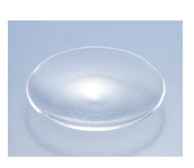
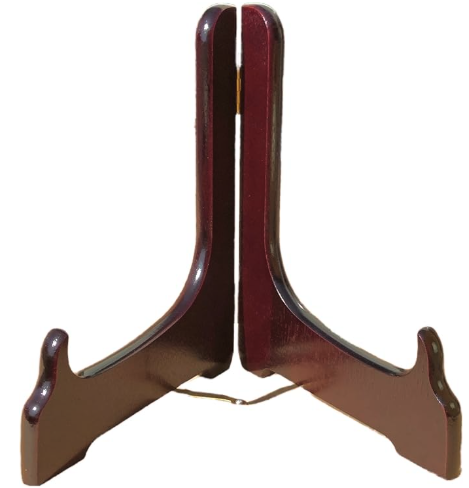

# 🍏　安価なブラックミラーの制作方法と使い方（W.E.バトラー準拠）

 
This page is maintained by ravensgate (KSC) a.k.a. Le Sorcier Inconnu.</vr> 

## Ⅰ. 材料
- **時計皿（並質ガラス φ100mm程度）**
  - 時計用のガラス。透明で安価（400円前後）
 

時計皿並室ガラス100φmm 

 

- **黒色スプレー塗料**
  - プラモデル用スプレー（黒 / 艶消し黒 /黒メタリック）
    
 

（例）タミヤ/TS-6 マットブラック 

 

- **皿立て（紀州3号など10〜14cm用）**
  - 木製または樹脂製のプレートスタンド
 
 

木製皿立て 

 

- 新聞紙やクラフト紙（塗装時の養生用）
- 手袋、マスク（塗装時の安全対策）

---

## Ⅱ. 製作手順
1. **下準備**
   - 時計皿を中性洗剤で洗浄し、完全に乾燥させる
   - 裏面（凸面）にスプレーを施すため、養生紙の上に置く

2. **塗装**
   - 凸面に均一にスプレーで黒を吹き付ける（凹面は塗装しない）
   - 数回に分けて薄く重ね塗りすることで、ムラを防ぐ
   - 完全乾燥まで半日～1日置く

  （例）撮影はKSCによる 

 

3. **仕上げ**
   - 凸面の塗装が定着したら、皿立てにセット
   - 正面からは黒い鏡面に見える状態になる

---

## Ⅲ. 使用環境（バトラー準拠）
- **照明**：暗めの部屋で、光を調整する（ロウソク、LED照明など）
- **姿勢**：背筋を正し、ミラーを目の高さに置き、正面から覗き込む
- **準備**：リラックスした呼吸法・軽い瞑想で心を整える

---

## Ⅳ. 基本的な使い方（3種類）

### 1. W.E.バトラー流（体系的訓練）

 

 

 

- **位置づけ**：「積極的な視覚化訓練」であり、心霊的な能力開発ではない
- **態度**：鏡を安定させ、完全にくつろいだ姿勢で半覚醒状態を保つ
- **行法の手順**
  1. **象徴イメージを投射**：ミラーに明確な象徴（図形・色・記号など）を送り込む
  2. **イメージの引き込み（逆転）**：投射した像を引っ込め、鏡に現れる自発的な像を静かに待つ
- **目的**：投射と受容の往復訓練で、イマジネーションと感受性を共に鍛える

### 2. A.O.スペア流（自己像の崩壊と無意識の顕現）

 

 

- **基本原理**：鏡をじっと見つめることで自己像を曖昧にし、自己同一性を揺らがす（『快楽の書』より）
- 注：『快楽の書』にはこの鏡をブラックミラーとは明示していない。しかし鏡の代わりとしては情報量が落ちるのでむしろ理想的
- **方法**
  1. 鏡を凝視し続けることで、顔の像が歪み、変容する
  2. その過程で「自我」という固定的な枠組みが崩れ、無意識が表面化する
  3. シジルや欲望を一瞬想起して忘却し、黒の虚空に沈めるイメージを構築できる
- **意義**：「自己意識を変容させる実践」として機能し、黒い煙のようになって、忘却、無作為、無意識に消えるイメージを構築できる

### 3. 立体視重ね合わせ法による視覚化訓練（KSCによる開発）

（参考）KSCのXへの投稿ー2025年3月 

 

 

- **コンセプト**：凹面の前に小物（像・シンボル等）を置き、ミラーに写る**二重像**を両眼視（交差法/平行法）で**空中合成**し、「存在するはずのない像」を安定保持する
- **狙い**：左右眼の融像を利用して**知覚のゲート**を外し、幻視の持続性と解像度を高める（空中に無いはずのものが実際に見える）
- **手順**
  1. 凹面が**手前**になるよう時計皿を設置し、鏡から5〜20cm前方に小物を置く（金色の小像やシジル板が推奨）
  2. 目線はミラー中央。小物の**実像**とミラーの**虚像**が**左右に二重**に見える距離を探る
  3. **交差法**または**平行法**で視線を調整し、二つの像が**空中で一つに重なる**ポイントを捉える
  4. 合成像が安定したら、**呼吸を浅く静かに**し、その像を**「あり得ない現前」**として保つ
  5. 徐々に像の輪郭が自己展開するのを観察（色彩・運動・象徴の出現を記録）
- **応用**：合成像を**選んだ象徴イメージ**に置換、またはスペア流の**忘却**と組み合わせてブラックミラーの奥に沈める

---

## Ⅴ. 応用
- **象徴投射**：五芒星・杯・色や形など、意図を込めた象徴イメージを鏡に投射する
- **受容**：投射したイメージを引き込み、その後に浮かぶ像や変化を観察する
- **テーマ設定**：選んだ象徴によって、現れる像がテーマに応答するように作用する

---

## Ⅵ. 交差法 / 平行法 クイックガイド
- **交差法（寄り目）**
  1. 眉間の手前に指先を立て、指に一旦ピント→ゆっくり引き、背景の像が**3つ**に見えたら中央像に注意を固定
  2. そのまま**中央像**だけを保ち、周辺をボカす。近距離の小物に適する
- **平行法（目を平行に）**
  1. 遠くの壁にピントを合わせたまま、視線を**平行**にして鏡を視野に入れる
  2. 目の力を抜き、二重像の**中央合成像**が自然に立ち上がるのを待つ。大きめの配置に適する
- **安定のコツ**
  - 合成像が流れる場合は**瞬き→微小な再調整**
  - 光源は弱め。合成像に**反射のハイライト**が重なるよう角度を微調整
  - 時間は**3〜7分**を目安に、慣れたら延長

---

## Ⅶ. 安全と注意点
- **守護法**：使用前後にLBRPなどの儀式（十字のサイン、聖名・守護霊名の呼称など）
- **グラウンディング**：終了後は深呼吸・常温の水・軽食・ストレッチ
- **眼精疲労への配慮**：痛みや頭痛が出たら即休止。交差/平行は**1セット5分以内**から
- 無理に映像を得ようとせず、自然に浮かぶものを待つ
- 精神的に不安定な時には使用を避ける
- 実践記録（日付・方法・配置・所感）を残し、再現性を高める

---

👉 この方法なら、**黒曜石の鏡が数万円するのに対し、時計皿＋塗料＋皿立てで合計2,000円以下**で作成可能。  
👉 **バトラー流＝能動訓練**、**スペア流＝無作為**、**立体視法＝知覚のゲート操作**として使い分け・併用できる。

---

こちらもご覧ください➡️[ディスコーディアン魔術アーカイブ](https://github.com/ravensgate-tux/Discordianism_ksc/blob/main/README.md)

---
© 2025 知られざる呪術師（Le Sorcier Inconnu）  
本ドキュメントは [Creative Commons BY-SA 4.0](https://creativecommons.org/licenses/by-sa/4.0/deed.ja) に基づき公開されています。
