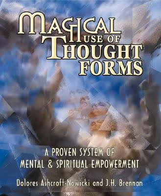

# 🏰 記憶の宮殿ワーク（ハービー・ブレナン方式）

> ⚠️ このワークは Herbie Brennan の  
> 『Magical Use of Thought Forms』に紹介されている手法を、  
> BBC『Sherlock』でも知られる「記憶の宮殿（Memory Palace）」の  
> イメージに合わせ、ディスコーディアン的にアレンジしたものです。

 
（画像出典）amazon.com

 

---

## 概要
「記憶の宮殿」を使い、意識と無意識を整理するための基本ワーク。  
掃除と探索を通じて、内的世界の浄化と構造理解を進める。

---

## 手順
1. お城や図書館など、実際に使っていてよく知っている建物を1つ選ぶ  
2. イメージの中でその部屋を詳細に観察する  
3. 掃除を開始する  
   - 天井 → 壁 → 家具 → 床の順
   - 家具も動かして裏まで掃除  
   - 本や小物も1つずつ描写しながら掃除  
4. 不要なものは部屋の外に出し、火で焼くか廃棄する  
5. 掃除後、部屋を出て「宮殿」全体を探索する  
   - 扉、隠し通路、聖堂、庭、地下牢などを自由に探検する  
6. 発見した場所や体験は必ず記録する  

---

## 探索要素
- **聖堂**: 祈り・供犠の場所  
- **地下牢**: トラウマの象徴。安易に閉じ込めず、癒しを目指す  
- **庭**: 休養・回復。水や自然がある  
- **スピリチャル・ガイド**: 高次自己・霊的教師。期待せずに現れるのを待つ  

---

## ポイント
- 掃除＝心のゴミを処理する象徴行為  
- 定期的に繰り返すことで、精神の明晰さが増す  
- 聖堂は祈りや供犠に、庭は休養に使える  
- 生きている人物のイメージは扱わない

---

## （資料1） ドゥーン城　『モンティ・パイソン・アンド・ホーリー・グレイル』（英: Monty Python and the Holy Grail）のロケ地

 
City / Kingdom landscape.

 

>画像出展：
>CC BY-SA 4.0
>File:Scotland-2016-Aerial-Doune Castle (and Castle keeper's cottage).jpg
>Created: 4 August 2016
>Uploaded: 10 September 2016
>Location: 56° 10′ 42.43″ N, 4° 2′ 52.94″ W

 
City / Kingdom landscape.

 

>画像出展：
>English: Ground and first floor plans of Doune Castle, near Stirling, Scotland.
>日付	2008年10月16日
>原典	Own work by uploader, based on plan in Simpson, W.D. "Doune Castle" Proceedings of the Society of Antiquaries of Scotland 72: 73-83
>作者	Jonathan Oldenbuck

Doune Castle の内部：

[Inside DOUNE CASTLE - Filming Location for OUTLANDER & GAME OF THRONES - Walking Tour | 4K | 60FPS](https://www.youtube.com/watch?v=KO9woTR4gA0)   

このような3Dモデルがあると城の構造が把握しやすい：

 
撮影：Le Sorcier Inconnu

 

---

こちらもご覧ください➡️[ディスコーディアン魔術アーカイブ](https://github.com/ravensgate-tux/Discordianism_ksc/blob/main/README.md)

---
© 2025 知られざる呪術師（Le Sorcier Inconnu）  
本ドキュメントは [Creative Commons BY-SA 4.0](https://creativecommons.org/licenses/by-sa/4.0/deed.ja) に基づき公開されています。

  
