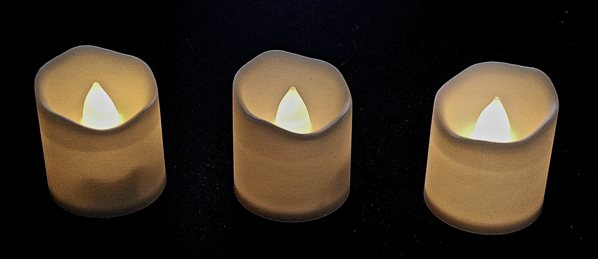
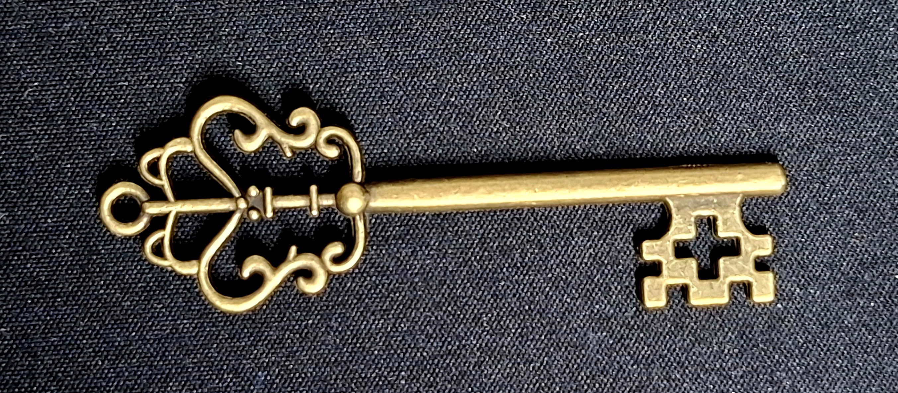
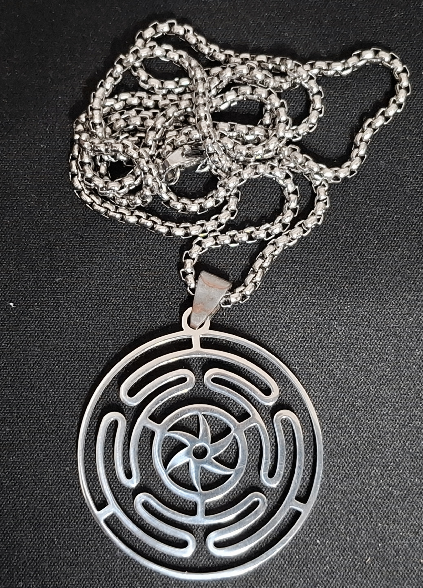
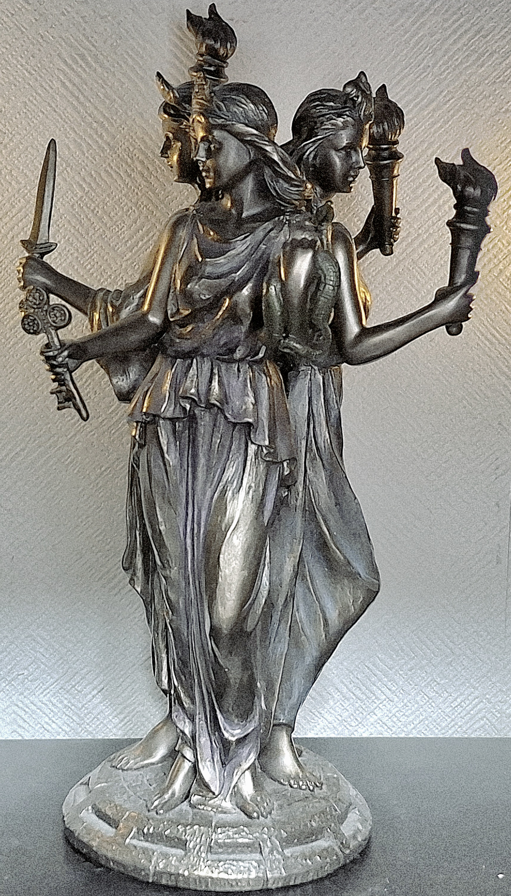
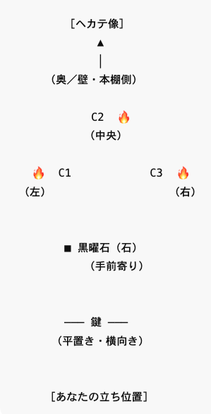

# ヘカテのためのインボルクの儀式（SOL風）

 
This page is maintained by ravensgate (KSC) a.k.a. Le Sorcier Inconnu.</vr> 
著者のKSCこと「知られざる呪術師」は ドロレス・アッシュクロフト=ノーウィッキから直接第３位界のイニシエーションを受け ダイアン・フォーチュンから続く法脈を受け継いでいる。

---

## 2026年2月1日〜2日／インボルク
このファイルは、SOL（Servants of the Light）における作業倫理を踏まえた  
簡潔・非演出的・操作性を排した形で構成されたヘカテのインボルクの儀式である  
セリフ（発話文）はドロレス・アッシュクロフト＝ノーウィッキ風の英文で、説明は日本語で記している

魔法円、アサメイ、召喚的操作は使わない

---

## 用意するもの（Materials）

**白い蝋燭 × 3**  

 

**鍵 × 1**  
  

 

**黒い石または木片 × 1**  

 

**その他**  

 

 
  
---

## 配置（Arrangement）

- 蝋燭は三角形に配置する  
  - 頂点は術者側ではなく奥  
  - 中央の蝋燭はやや奥  
- 鍵は平置き・水平に、手前  
- 石は蝋燭と鍵の間  
- ヘカテ像や図像がある場合は、蝋燭のさらに奥に置く  

※ 魔法円や追儺の儀式は必要ない  
※ 象徴物の配置は東に向けなくても良い

 

  ---

## 儀式（The Rite）

### 1. オープニング（Opening）

中央の蝋燭のみを灯す  
深呼吸を一度だけ行う

次の言葉を述べる：

> **Hekate, Keeper of the Threshold,  
> I stand at the crossing.**

---

### 2. 三つの灯（The Three Lights）

左の蝋燭を灯す

> **What has been.**

右の蝋燭を灯す

> **What is.**

中央の炎を見る  
言葉は加えない

※ 三相を人格化しない。説明もしない

---

### 3. 中心作業（Central Work）

鍵に軽く触れる

次の言葉を述べる：

> **I do not ask for power.  
> I ask for clarity.**

1〜5分、沈黙する。  
何もイメージせず、何も問いかけない

---

### 4. 境界の確認（The Threshold）

三本の炎を順に見てから、中央を見る

次の言葉を述べる：

> **Show me where not to step.  
> Show me what need not be crossed.**

再び沈黙

---

### 5. クローズ（Closing）

左の蝋燭、右の蝋燭の順に消す  
中央の蝋燭を最後に消す

次の言葉を述べる：

> **The light is returned.  
> The threshold remains.**

その場を離れる  
記録・感想・解釈は行わない

---

## 注記

- この儀式は「願望達成」や「力の獲得」を目的としない  
- 満月であっても、増幅・チャージ・結果の確定は行わない  
- そのため、本儀式では  
  So mote it be や So shall it be などの  
  結果を成立・固定させる完了句を意図的に用いていない  
- クローズは作業を静かに終了し、日常へ戻るためのものである  

---

こちらもご覧ください➡️[ディスコーディアン魔術アーカイブ](https://github.com/ravensgate-tux/Discordianism_ksc/blob/main/README.md)

---
© 2025 知られざる呪術師（Le Sorcier Inconnu）  
本ドキュメントは [Creative Commons BY-SA 4.0](https://creativecommons.org/licenses/by-sa/4.0/deed.ja) に基づき公開されています。

