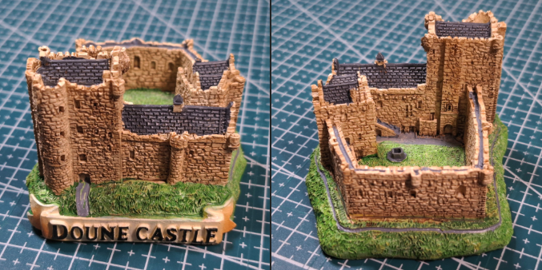

# 🍏 お城🏰を使ったパスワーキングの準備作業（清掃🧹🪣）
 

>本書の使い方 ― このパスワーキングの使い方 
>
このリポジトリは、お城を舞台にしたパスワーキング（内的探求の旅）を実践するためのワークをまとめています。  
特に、Herbie Brennan と Dolores Ashcroft-Nowicki の著作  
*Magical Use of Thought Forms: A Proven System of Mental & Spiritual Empowerment* (Llewellyn, 1990)  
で紹介されている「掃除ワーク」に着想を得ています。

---

## 🧹 導入ワーク：お城の掃除
パスワーキングの前に、心の中を整えるための準備として「掃除」を行います。

1. **掃除する部屋を決める**  
   - お城の大広間、塔の一室、地下牢など。  
2. **道具を想像する**  
   - バケツ、雑巾、ほうき、脚立など自由に設定。  
3. **細部をイメージする**  
   - 家具、壁、天井、窓枠などを順に掃除。  
4. **不要なものは処分する**  
   - 箱にまとめ、炎で燃やすか、湖に投げ入れる。  
5. **換気を行う**  
   - 窓を開け、澱んだ空気を新鮮な風に入れ替える。  

➡️ このワークを経ることで、心の雑念や停滞感をリセットし、  
お城を「清められた聖域」として探索を始めることができます。

---

## 🏰 パスワーキングの流れ（例）
1. 大広間から探索を開始  
2. 掃除が終わった空間を確認  
3. 秘密の通路や階段を見つけて進む  
4. 聖堂や礼拝堂を清めて祈りを捧げる  
5. 必要に応じて庭園や地下牢も訪れる  

---

## 📚 参考文献
- Dolores Ashcroft-Nowicki & J.H. Brennan,  
  *Magical Use of Thought Forms: A Proven System of Mental & Spiritual Empowerment*,  
  Llewellyn Publications, 1990.

## ⚠️ 注意
- 本リポジトリの内容は書籍の要約・応用であり、原文の引用ではありません。  
- 各自の実践経験に基づく自由な改変や追加を歓迎します。  

---

## （資料1） ドゥーン城　『モンティ・パイソン・アンド・ホーリー・グレイル』（英: Monty Python and the Holy Grail）のロケ地

 
City / Kingdom landscape.

 

>画像出展：
>CC BY-SA 4.0
>File:Scotland-2016-Aerial-Doune Castle (and Castle keeper's cottage).jpg
>Created: 4 August 2016
>Uploaded: 10 September 2016
>Location: 56° 10′ 42.43″ N, 4° 2′ 52.94″ W

 
City / Kingdom landscape.

 

>画像出展：
>English: Ground and first floor plans of Doune Castle, near Stirling, Scotland.
>日付	2008年10月16日
>原典	Own work by uploader, based on plan in Simpson, W.D. "Doune Castle" Proceedings of the Society of Antiquaries of Scotland 72: 73-83
>作者	Jonathan Oldenbuck

Doune Castle の内部：

[Inside DOUNE CASTLE - Filming Location for OUTLANDER & GAME OF THRONES - Walking Tour | 4K | 60FPS](https://www.youtube.com/watch?v=KO9woTR4gA0)   

このような3Dモデルがあると城の構造が把握しやすい：

 
撮影：Le Sorcier Inconnu

 

---

こちらもご覧ください➡️[ディスコーディアン魔術アーカイブ](https://github.com/ravensgate-tux/Discordianism_ksc/blob/main/README.md)

---
© 2025 知られざる呪術師（Le Sorcier Inconnu）  
本ドキュメントは [Creative Commons BY-SA 4.0](https://creativecommons.org/licenses/by-sa/4.0/deed.ja) に基づき公開されています。
