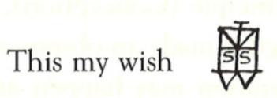
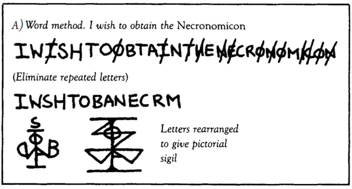

# 英語圏におけるケイオスマジックにおける「重複文字を消す」ルールは一般的か？

## 1. スペアのオリジナル（1913年）

-   オースティン・オスマン・スペアは
    **欲望の文章を抽象的な図に融合する** 方法を提示
-   『快楽の書』（1913）では、文字を融合・変形してシジル化するが、**重複文字を消す・母音を除去する**
    とは書いていない
-   実際にスペアのシジルには **同じ文字（特に S）が繰り返し登場**
    している

  

 

👉 つまり「重複文字を消す」ルールはスペア本人の発想ではない。

------------------------------------------------------------------------

## 2. ケイオスマジック初期（1970〜80年代）

-   ピーター・キャロル『Liber Null』（1978/87）が初めて
    **「重複文字を消す」** と明記

  

 

画像出典："Liber Null & Psychonaut" by Peter J. Carrol 
    
-   フィル・ハイン『Condensed
    Chaos』（1994）も同様に「文章を書き、重複を消し、残りで図形を作る」と説明
-   ただし **母音削除の指示はなかった**

👉 1980年代には「重複を消す」がほぼ定番化した。

------------------------------------------------------------------------

## 3. 母音削除の登場（1995年）

-   グラント・モリソンの漫画『The Invisibles』（1995）が転機
-   例文「It is my desire to visit Hitler's bunker」から
    **母音と重複を消す** 手順を紹介
-   以降、ネットや実践書に急速に広まり、**母音削除＋重複削除**
    がセットで普及

👉
母音を消すのはスペアやキャロル由来ではなく、**モリソン以降の新ルール**。

------------------------------------------------------------------------

## 4. 現在の実践

-   英語圏のブログ、YouTube、Reddit、アプリまで「重複＋母音削除」が
    **基本手順のように紹介** されている。
    　例：「文を書き → 母音と重複を消す →
    残りを組み合わせてシジル化」
-   多くの人が「当たり前のやり方」と信じている

ただし：
-
Redditなどでは「母音を消すのは伝統ではない、ただ今の流行」と明言される。
- 実際には「重複だけ消す」「母音は残す」「全く消さないで融合する」など
**個人差が大きい**。
- ルーンや他言語アルファベットを使う場合、母音を残すケースも普通にある

👉
**「全員が必ずやっている」わけではない**が、英語圏では初心者向け解説ではほぼ必ず出てくる。

------------------------------------------------------------------------

## 5. 理由と背景

-   **重複削除**：シンプル化し、図形をスッキリさせる
-   **母音削除**：単語っぽさを消し、忘却（シジルの基本）を容易にする
-   歴史的正統性というより、**心理的・実用的に便利だから広まった**

------------------------------------------------------------------------

## 6. トレンドの変化

-   1913年 スペア：重複も母音も削除しない
-   1980年代 キャロル／ハイン：重複削除のみ
-   1995年 モリソン：母音＋重複削除を紹介
-   2000年代以降：両方削除が「基本」とされる

------------------------------------------------------------------------

## まとめ

-   **重複文字を消す手順は、英語圏では「一般的な常識」のように扱われている**
-   ただしそれはキャロル以降の発明で、スペアの方法ではない
-   母音削除はモリソン以降に流行したルールであり、伝統ではない
-   現在も「必須」ではなく、**各自の工夫でアレンジ可能**
-   ケイオスマジックの本質は「自由実験」であり、方法論は固定されていない
-   **重複文字を残せばシジルを左右対称につくれたり、リズムやバランスを表現でき美しく作成できる（スペアのシジル）**

------------------------------------------------------------------------

## 🍏 ディスコーディアン的な結論として：
英語圏では「重複文字を消す（＋母音削除）」は **非常に一般的で普及している**が、歴史的にはスペアのやり方とは異なり、**後世に作られた「便利なルール」にすぎない**。  
ただし効率化によってシジルから美と力を奪うのは、まさにオカルティスト **ダイアン・フォーチュン**や **W.E.バトラー**も批判的に引用した英語の諺、  

> *“Throwing the baby out with the bathwater”*  
> （生湯と一緒に赤ん坊まで流してしまう）  

を思わせる。さらに補足すると、
この英語の諺である「不要なものを捨てるときに、本当に大切なものまで捨ててしまっている」という意味は、
この重複の削除という部分が、シジルを美的に制作することを妨げ、シジルの効果を弱めている可能性が捨てきれないということである。
つまり重複文字を削除せず、スペアのシジル制作法に戻る価値が大いにあると考えられる。  

---

## 🍏 参照

- [🍏 重複文字を消さないAOS流シジル作成（2025年8月29日）](https://github.com/ravensgate-tux/sigil_duplicates/blob/main/README.md)
