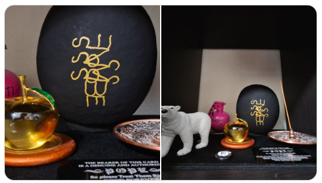

# 🍏 ディスコーディアン魔術：だるま魔術 （シジル魔術） ver.1　

 

本プロトコルは日本語によるシンプルなだるま魔術の手順である。  
オースティン・オスマン・スペアの「快楽の書」、フィル・ハインの「PRIME CHAOS」のディスコーディアン魔術に関する章から着想を得ている。  

---

## 1. シジルを作成する
- 願望を示す、短い英語の文を作成する  
  例： `SUCCESS SALES`
- 注：重複文字は削除しない  
- 参照 👉：[🍏 重複文字を消さないAOS流シジル作成（2025年8月29日）](https://github.com/ravensgate-tux/sigil_duplicates/blob/main/README.md)

## 2. だるまの背中にシジルを描く
- 左目に目を入れる。願いがかなったら右目にも
- 好みに応じて、左目に「阿」、右目に「吽」の梵字を入れてもよい

 

## 3. チャージ
- 達磨大師の「面壁九年」にあやかって、九に関する期間、壁に向けてだるまを置く
- 背中のシジルはこちらに見えるようにする
- 九時間や九日などの期間、チャージする（シジルを心に入れる）

 

## 4. 忘却
- 達磨を片付ける。購入時の箱があればそこに戻しておく
- このシジルのことを自然に忘れる期間を置く
- 下記のジェイソン・ミラーの観点から、目標達成するために努力をする

> Make a plan that could work without magick, then use magick to make that plan work better. 
> 魔術がなくても成立する計画を立て、それをより良く機能させるために魔術を使え

## 5. 願望がかなったら
- 手順2で決めたルールに従って右目を入れる
- 両目を入れただるまを飾り、感謝を行う
- 購入時の箱にしまう

---

## 参考文献・インスピレーション
- Austin Osman Spare, *The Book of Pleasure (Self-Love): The Psychology of Ecstasy*  
- Phil Hine, *Prime Chaos*（特に「ディスコーディアン魔術」に関する章）  

## ライセンス
本ドキュメントは [Creative Commons CC-BY-SA 4.0](https://creativecommons.org/licenses/by-sa/4.0/deed.ja) で公開します。  
自由に利用・改変・共有できますが、出典を明記してください。  
