# 🍏 ギレルモ・デル・トロ監督映画作品でのパスワーキング

 

>本書の使い方 ― パスワーキングのやり方 
>
>本書はギレルモ・デル・トロ作品の大アルカナをタペストリーとして観想し、世界（XXI）から愚者（0）へ、マルクトから32番の小径を通って上昇する伝統に従い進むパスワーキングの指示書である。まずこのプロトコルの最後にあるドゥーン城を視覚化し、その入り口から順に大アルカナのタペストリーがかかっている様子を思い描く。それぞれのタペストリーを視覚化したら、その前で与えられたテキストを禅の公案のように黙想する。理解できたと感じたら、あるいはタペストリーがあなたを受け入れ「通過して良い」と告げたと感じたら前に進め。入り口から城に入り、部屋や中庭を抜け、順に上階へと進み、最終的には塔の頂に立ち、世界を見下ろすことになる。重要なのは、各大アルカナの象徴的意味と、その小径が結ぶセフィロトの質を意識することにある。映画はその体験を助ける触媒であり、従来の象徴図形を超えて、光や音、質感、登場人物の感情までを一瞬で想起させる圧倒的な情報量と臨場感をもたらす。これにより小径の体験は格段に強まり、パスワーキング全体のパワーが増幅されるだろう。

 
This page is maintained by ravensgate (KSC) a.k.a. Le Sorcier Inconnu.</vr> 
著者のKSCこと「知られざる呪術師」は ドロレス・アッシュクロフト=ノーウィッキから直接第３位界のイニシエーションを受け ダイアン・フォーチュンから続く法脈を受け取っている。

---

## 世界 XXI

 

 

**映画**: *The Mimic*  
**キャラクター**: Judas Breed（ユダ種／人間に擬態する巨大昆虫）

**テキスト**:  
*"The butterfly does not look back upon its caterpillar self, either fondly or wishfully, it simply flies on."*  
— *The Night Eternal*  

**日本語訳**:  
「蝶は毛虫であった自分を、懐かしむことも惜しむこともなく、ただ飛び去る（The Night Eternal）」  

**指示**:  
このタペストリーの前で、この言葉を禅の公案のように黙想せよ。理解できたと感じたら、あるいはタペストリーがあなたを受け入れ「通過して良い」と告げたと感じたら前に進む。

---

## 審判 XX

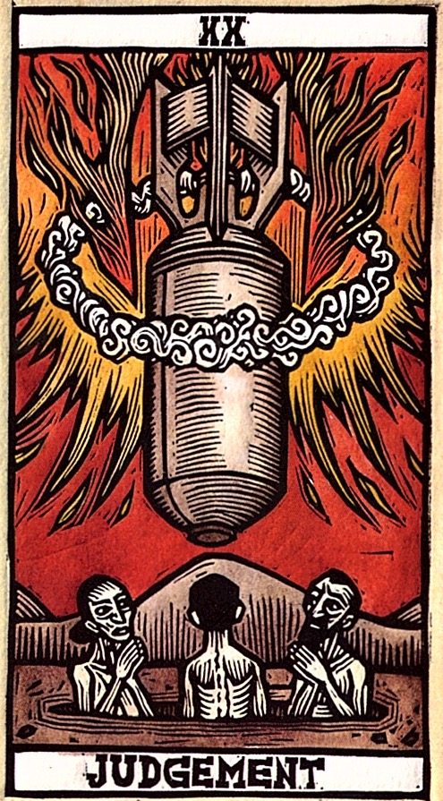 

 

**映画**: *The Devil’s Backbone*  
**キャラクター**: 巨大な錆びた爆弾  

**テキスト**:  
*"This is what the beginning of the end of the world will look like."*  
— *The Strain*  

**日本語訳**:  
「これが世界の終わりの始まりの姿だ（The Strain）」  

**指示**:  
このタペストリーの前で、この言葉を禅の公案のように黙想せよ。理解できたと感じたら、あるいはタペストリーがあなたを受け入れ「通過して良い」と告げたと感じたら前に進む。

---

## 太陽 XIX

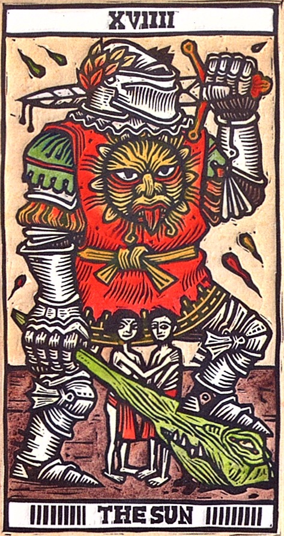 

 

**映画**: *Pacific Rim*  
**キャラクター**: イェーガー

**テキスト**:  
*"Night is not an absence of light, but in fact, it is daytime that is a brief respite from the looming darkness…"*  
— *The Strain*  

**日本語訳**:  
「夜は光の不在ではない。むしろ、昼こそが、すべてを覆う闇からのつかの間の休息なのだ（The Strain）」  

**指示**:  
このタペストリーの前で、この言葉を禅の公案のように黙想せよ。理解できたと感じたら、あるいはタペストリーがあなたを受け入れ「通過して良い」と告げたと感じたら前に進む。

---

## 月 XVIII

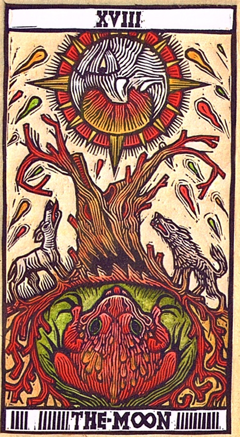 

 

**映画**: *Pan’s Labyrinth*  
**キャラクター**: ヒキガエル  

**テキスト**:  
*"The moon wiJI be full in three days. Your spirit shall forever remain among' the humans. You shall die like them, you shall die like them, and all memory of you shall fade in time."*  
— *Pan's Labyrinth*  

**日本語訳**:  
「月は三日後に満ちる。おまえの魂は永遠に人間たちの間に留まるのだ。おまえは彼らのように死に、彼らのように死に、やがておまえの記憶も時とともに消え去るだろう（Pan's Labyrinth）」  

**指示**:  
このタペストリーの前で、この言葉を禅の公案のように黙想せよ。理解できたと感じたら、あるいはタペストリーがあなたを受け入れ「通過して良い」と告げたと感じたら前に進む。

---

## 星 XVII

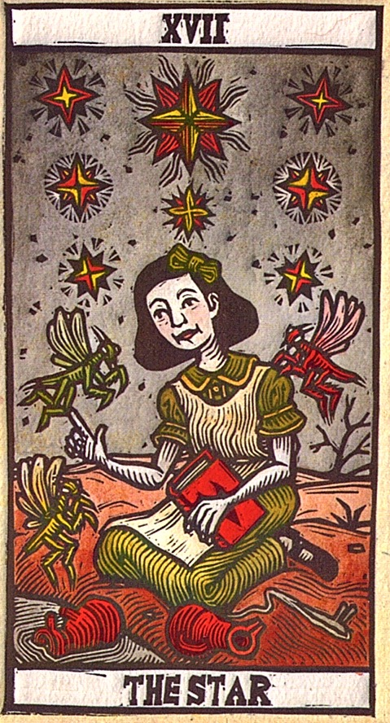 

 

**映画**: *Pan’s Labyrinth*   
**キャラクター**: オフェリア 

**テキスト**:  
*"When I was a kid, whenever ['d feel small or lonely,
I'd look up at the stars."*  
— *Pacific Rim*  

**日本語訳**:  
「子どもの頃、ちっぽけに感じたり孤独を覚えたりすると、いつも星空を見上げていた（Pacific Rim）」  

**指示**:  
このタペストリーの前で、この言葉を禅の公案のように黙想せよ。理解できたと感じたら、あるいはタペストリーがあなたを受け入れ「通過して良い」と告げたと感じたら前に進む。

---

## 塔 XVI

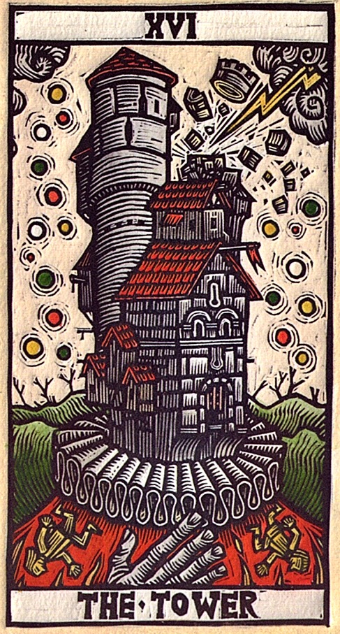 

 

**映画**: *Pacific Rim*   
**キャラクター**: 塔  

**テキスト**:  
*"There are thing's you can't fight-acts of God. You see a　hurricane coming'; you get out of the way."*  
— *Pacific Rim*  

**日本語訳**:  
「抗えないものもある──天災だ。ハリケーンが来ると分かれば、道を空けるしかない（Pacific Rim）」  

**指示**:  
このタペストリーの前で、この言葉を禅の公案のように黙想せよ。理解できたと感じたら、あるいはタペストリーがあなたを受け入れ「通過して良い」と告げたと感じたら前に進む。

---

## 悪魔 XV

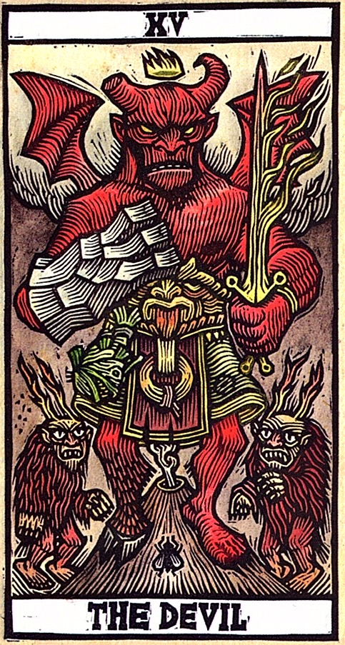 

 

**映画**: *Hellboy*  
**キャラクター**: ヘルボーイ  

**テキスト**:  
*"To learn what we fear is to learn who we are."*  
— *Guillermo Del Toro*  

**日本語訳**:  
「私たちが恐れるものを知ることは、私たちが何者であるかを学ぶことである（Guillermo Del Toro）」  

**指示**:  
このタペストリーの前で、この言葉を禅の公案のように黙想せよ。理解できたと感じたら、あるいはタペストリーがあなたを受け入れ「通過して良い」と告げたと感じたら前に進む。

---

## 節制 XIV

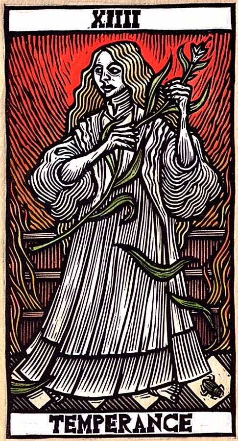 

 

**映画**: *Crimson Peak*  
**キャラクター**: イーディス・カッシング 

**テキスト**:  
*"...down here, hate has no purpose. Down here, you
embrace your foes until they become your friends. Down
here, you seek not to be one being', but all being's, and all at
once[...] She is full. She is perfect."*  
— *The Shape of Water (Novelization)*  

**日本語訳**:  
「……ここでは、憎しみには意味がない。ここでは、敵を抱きしめ、やがて友へと変えていく。ここでは、一つの存在であろうとするのではなく、すべての存在であり、すべてを同時に生きようとする……彼女は満ちている。彼女は完璧なのだ（The Shape of Water）」  

**指示**:  
このタペストリーの前で、この言葉を禅の公案のように黙想せよ。理解できたと感じたら、あるいはタペストリーがあなたを受け入れ「通過して良い」と告げたと感じたら前に進む。

---

## 死 XIII

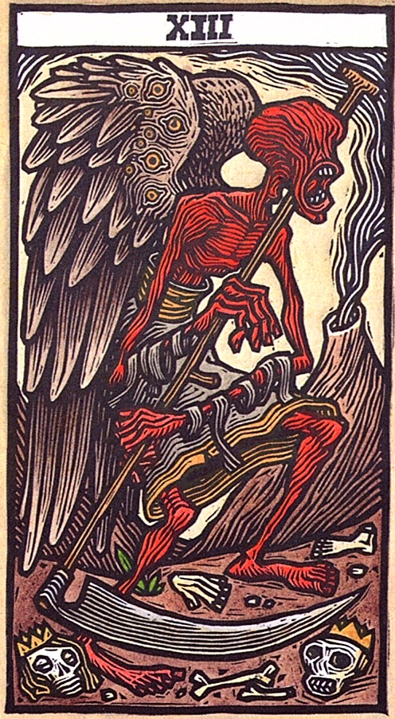 

 

**映画**: *Hellboy II: The Golden Army*  
**キャラクター**: 死の天使
**テキスト**:  
*"She forgot who she was and where she came from.
Her body suffered cold, sickness, and pain. Eventually,
she died."*  
— *Pan's Labyrinth*  

**日本語訳**:  
「彼女は自分が誰で、どこから来たのかを忘れてしまった。
彼女の身体は寒さと病と痛みに苦しみ、やがて彼女は死んだ（Pan's Labyrinth）」  

**指示**:  
このタペストリーの前で、この言葉を禅の公案のように黙想せよ。理解できたと感じたら、あるいはタペストリーがあなたを受け入れ「通過して良い」と告げたと感じたら前に進む。

---

## 吊られた男 XII

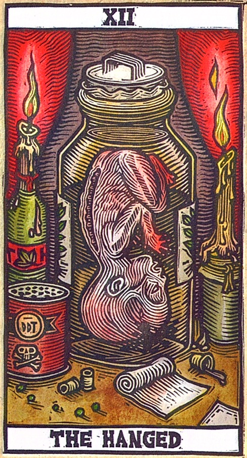 

 

**映画**: *The Devil’s Backbone*  
**キャラクター**: 胎児  

**テキスト**:  
*"Feet are what connect you to the ground, and when
you are poor, none of that ground belongs to you."*  
— *The Shape of Water (Novelization)*  

**日本語訳**:  
「足はあなたを大地につなぐものだ。だが貧しい者にとって、その大地はひとつとして自分のものではない（The Shape of Water）」  

**指示**:  
このタペストリーの前で、この言葉を禅の公案のように黙想せよ。理解できたと感じたら、あるいはタペストリーがあなたを受け入れ「通過して良い」と告げたと感じたら前に進む。

---

## 力 XI

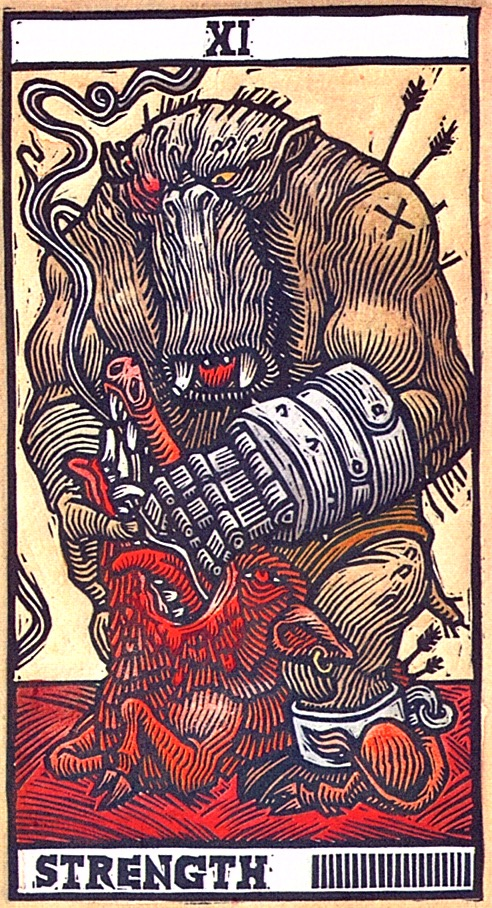 

 

**映画**: *Hellboy II: The Golden Army*  
**キャラクター**: ミスター・ウィンク 

**テキスト**:  
*"Weakness is giving in to temptation. Strength is
resisting it."*  
— *The Night　Eternal*  

**日本語訳**:  
「弱さとは誘惑に屈すること。強さとはそれに抗うことだ（The Night　Eternal）」  

**指示**:  
このタペストリーの前で、この言葉を禅の公案のように黙想せよ。理解できたと感じたら、あるいはタペストリーがあなたを受け入れ「通過して良い」と告げたと感じたら前に進む。

---

## 運命の輪 X

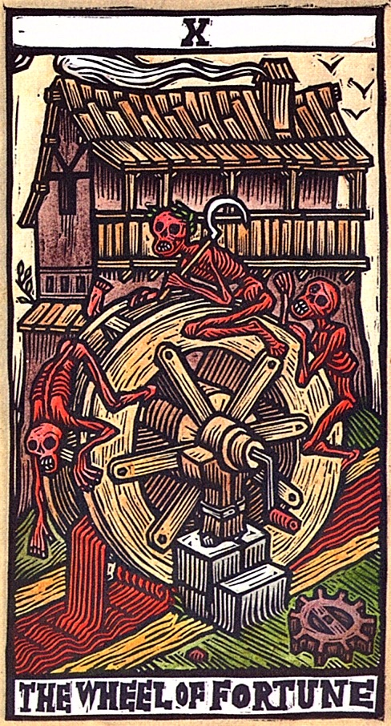 

 

**映画**: *Pan’s Labyrinth*     
**キャラクター**: 運命の輪  

**テキスト**:  
*"Stay by my side as I fade / so you can point to the end of
my struggle / and the twilight of eternal days / at the low,
dark edge of life."*  
— *TTRANSLATION OF A FRAGMENT OF "IN MEMORIAM
A.H.H." BY ALFRED, LORD TENNYSON,
IN THE DEVIL'S BACKBONE*  

**日本語訳**:  
「私が消えゆくとき そばにいてほしい / そうすれば あなたは私の闘いの終わりを指し示し / 永遠の日々の黄昏を / 人生の低く暗い縁で見届けられるのだから（The Devils Backbone）」  

**指示**:  
このタペストリーの前で、この言葉を禅の公案のように黙想せよ。理解できたと感じたら、あるいはタペストリーがあなたを受け入れ「通過して良い」と告げたと感じたら前に進む。

---

## 隠者 IX

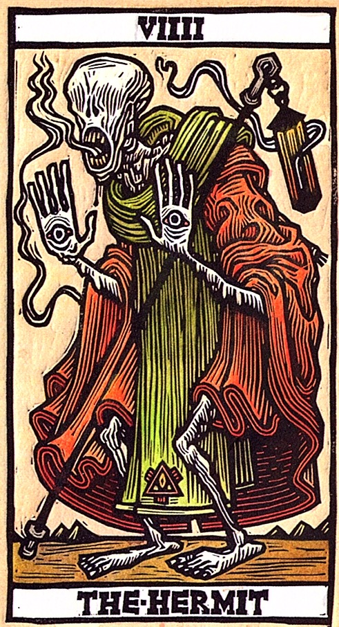 

 

**映画**: *Pan's Labyrinth*   
**キャラクター**: ペイルマン（Pale Man）  

**テキスト**:  
*"The most intelligent of creatures often make the
fewest sounds."*  
— *The Shape of Water*  

**日本語訳**:  
「最も賢い生き物は、しばしば最も少ない音しか立てないものだ（The Shape of Water）」  

**指示**:  
このタペストリーの前で、この言葉を禅の公案のように黙想せよ。理解できたと感じたら、あるいはタペストリーがあなたを受け入れ「通過して良い」と告げたと感じたら前に進む。

---

## 正義 VIII

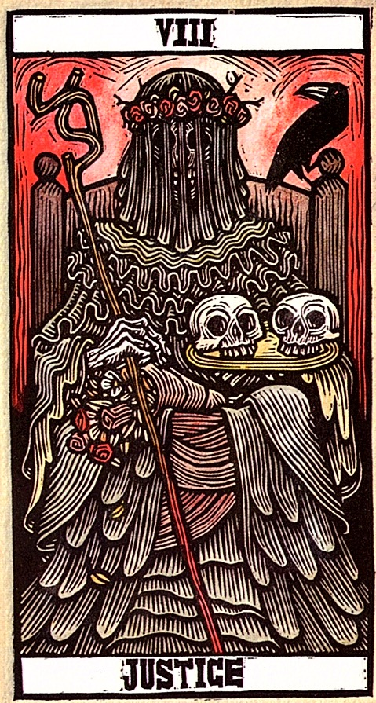 

 

**映画**: *Crimson Peak*  
**キャラクター**: イーディス・カッシングの母親の幽霊  

**テキスト**:  
*"Man killing man, man helping man, both of them
anonymous: the scourge and the blessing."*  
— *The Strain (Graphic Novel)*  

**日本語訳**:  
「人が人を殺す。人が人を助ける。そのどちらも名もなき行為──災いであり、また祝福でもある（The Strain）」  

**指示**:  
このタペストリーの前で、この言葉を禅の公案のように黙想せよ。理解できたと感じたら、あるいはタペストリーがあなたを受け入れ「通過して良い」と告げたと感じたら前に進む。

---

## 戦車 VII

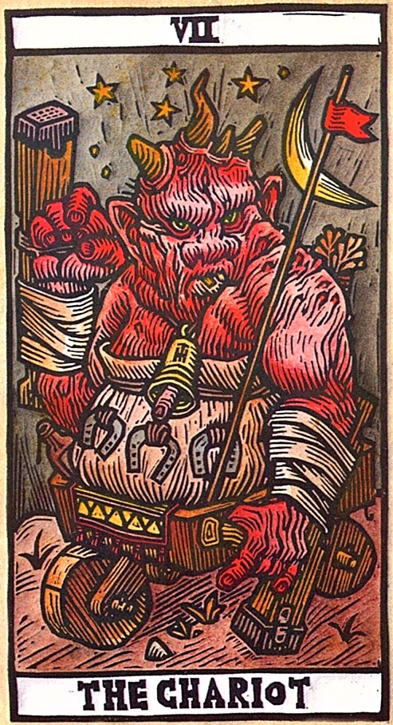 

 

**映画**: *Hellboy II: The Golden Army*  
**キャラクター**: トロール（Troll） 

**テキスト**:  
*"A key piece of advice [...]. If a road is not presented,
you build one."*  
— *Guillermo Del Toro*  

**日本語訳**:  
「大切な助言──道が示されないなら、自ら道を切り拓け（Guillermo Del Toro）」  

**指示**:  
このタペストリーの前で、この言葉を禅の公案のように黙想せよ。理解できたと感じたら、あるいはタペストリーがあなたを受け入れ「通過して良い」と告げたと感じたら前に進む。

---

## 恋人 VI

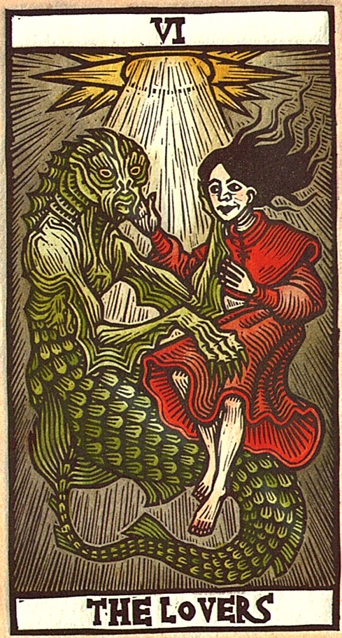 

 

**映画**: *The Shape of Water*  
**キャラクター**: イライザ（Elisa Esposito） 両生類の男（The Amphibian Man）

**テキスト**:  
*"But I can't be alone, can I? Of course not, I'm not that
special. [...] What if you and I arc not the last of our
kinds, but one of the first? The first of better creatures in
a better world? We can hope, can't we? That we're not
of the past, but the future?"*  
— *The Shape of Water (Novelization)*  

**日本語訳**:  
「でも、私はひとりではいられない、そうだろう？もちろんだ、私はそんなに特別な存在じゃない。[…] もし君と私が、私たちの種の“最後”じゃなく、“最初”だとしたらどうだろう？より良い世界に生きる、より良い生き物たちの最初の一員だとしたら？願えるじゃないか、そうだろう？私たちは過去ではなく、未来の存在なのだと（The Shape of Water）」  

**指示**:  
このタペストリーの前で、この言葉を禅の公案のように黙想せよ。理解できたと感じたら、あるいはタペストリーがあなたを受け入れ「通過して良い」と告げたと感じたら前に進む。

---

## 法王 V

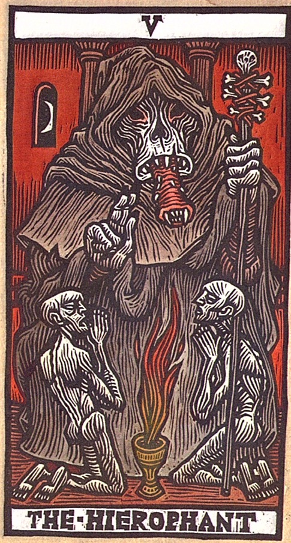 

 

**映画**: *The Strain*  
**キャラクター**: マスター（The Master）  

**テキスト**:  
*"It is not faith that distinguishes our real leaders. It is doubt.
Their ability to overcome it."*  
— *The Night Eternal*  

**日本語訳**:  
「真の指導者を決定づけるのは信仰ではなく疑念、そしてそれを乗り越える力だ（The Night Eternal）」  

**指示**:  
このタペストリーの前で、この言葉を禅の公案のように黙想せよ。理解できたと感じたら、あるいはタペストリーがあなたを受け入れ「通過して良い」と告げたと感じたら前に進む。

---

## 皇帝 IV

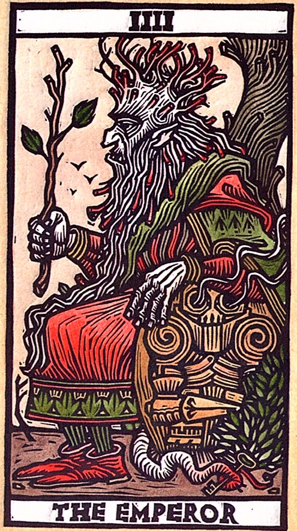 

 

**映画**: *Hellboy II: The Golden Army*  
**キャラクター**: バロル（Balor） — エルフの王  

**テキスト**:  
*"But Captain, to obey, just like that, for obedience's sake ... without questioning ... that's something only people like you do."*  
— *Pan's Labyrinth*  

**日本語訳**:  
「だが大尉、ただ従うために従うなんて……疑いもせずに……そんなことをするのは、あなただけだ（Pan's Labyrinth）」  

**指示**:  
このタペストリーの前で、この言葉を禅の公案のように黙想せよ。理解できたと感じたら、あるいはタペストリーがあなたを受け入れ「通過して良い」と告げたと感じたら前に進む。

---

## 女帝 III

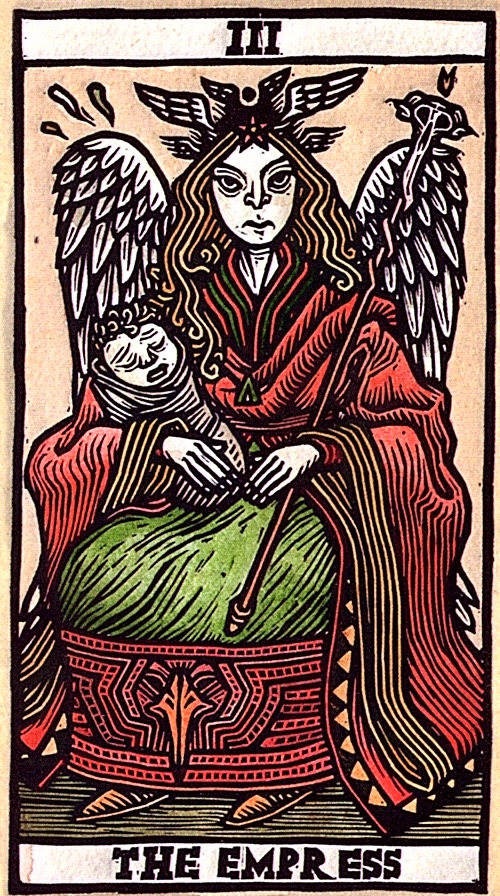 

 

**映画**: *Pan’s Labyrinth*  
**キャラクター**: カルメン（Carmen） — オフェリアの母

**テキスト**:  
*"There's something about maternal love — it might just be the strongest human spiritual bond there is."*  
— *The Fall*  

**日本語訳**:  
「母の愛というものには特別な力がある──それはおそらく、人間における最も強い精神的な絆なのだろう(The Fall)」  

**指示**:  
このタペストリーの前で、この言葉を禅の公案のように黙想せよ。理解できたと感じたら、あるいはタペストリーがあなたを受け入れ「通過して良い」と告げたと感じたら前に進む。

---

## 女教皇 II

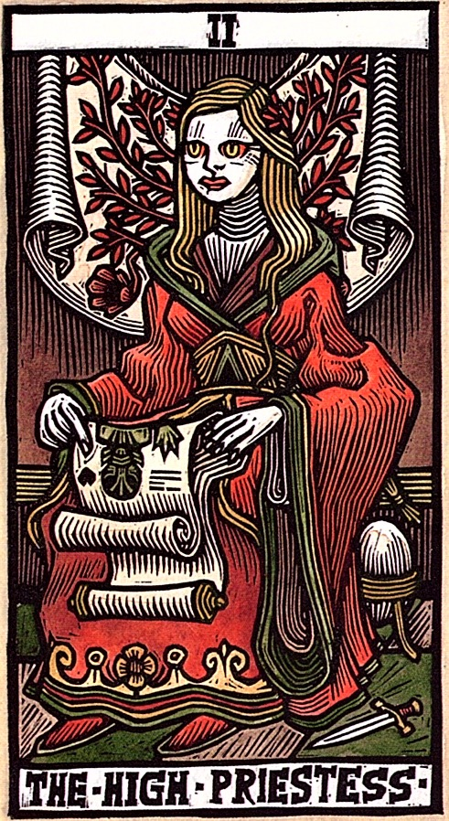 

 

**映画**: *Hellboy II: The Golden Army*  
**キャラクター**: ヌアラ（Princess Nuala） — エルフの王女、プリンス・ヌアダの双子の妹

**テキスト**:  
*"Everything in our universe is ciphered, and to know the cipher is to know the thing — and to know the thing is to command it."*  
— *The Fall*  

**日本語訳**:  
「この宇宙に存在するすべては暗号化されている。その暗号を知ることは、そのものを知ること──そして、そのものを知ることは、それを支配することだ（The Fall）」  

**指示**:  
このタペストリーの前で、この言葉を禅の公案のように黙想せよ。理解できたと感じたら、あるいはタペストリーがあなたを受け入れ「通過して良い」と告げたと感じたら前に進む。

---

## 魔術師 I

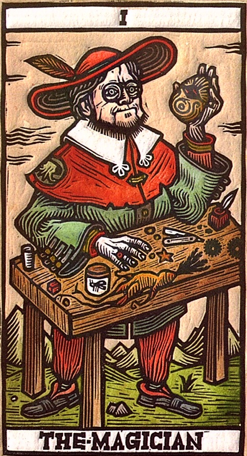 

 

**映画**: *なし（デル・トロ本人がモデル）*  
**キャラクター**: ギレルモ・デル・トロ監督 

**テキスト**:  
*"Hidden in every limitation lies an opportunity. And for every obstacle you face, there is a simple and perfect solution, creatively. And your work is to find it."*  
— *Guillermo del Toro*  

**日本語訳**:  
「すべての制限の中には可能性が隠されている。直面するあらゆる障害には、創造的に見出せる単純で完璧な解決策がある。君の仕事はそれを見つけることだ（Guillermo del Toro）」  

**指示**:  
このタペストリーの前で、この言葉を禅の公案のように黙想せよ。理解できたと感じたら、あるいはタペストリーがあなたを受け入れ「通過して良い」と告げたと感じたら前に進む。

---

## 愚者 0

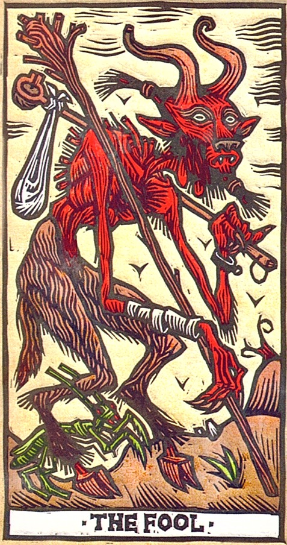 

 

**映画**: *Pan’s Labyrinth*  
**キャラクター／場面**: 少女が未知へ踏み出す瞬間  

**テキスト**:  
*"To step into the unknown is to become free."*  

**日本語訳**:  
「未知へと踏み出すことが、自由になることだ。」  

**指示**:  
このタペストリーの前で、この言葉を禅の公案のように黙想せよ。理解できたと感じたら、あるいはタペストリーがあなたを受け入れ「通過して良い」と告げたと感じたら終了である。塔の上に上がって世界を見下ろすことができる。

---

## （資料1） ドゥーン城　『モンティ・パイソン・アンド・ホーリー・グレイル』（英: Monty Python and the Holy Grail）のロケ地

 
City / Kingdom landscape.

 

>画像出展：
>CC BY-SA 4.0
>File:Scotland-2016-Aerial-Doune Castle (and Castle keeper's cottage).jpg
>Created: 4 August 2016
>Uploaded: 10 September 2016
>Location: 56° 10′ 42.43″ N, 4° 2′ 52.94″ W

 
City / Kingdom landscape.

 

>画像出展：
>English: Ground and first floor plans of Doune Castle, near Stirling, Scotland.
>日付	2008年10月16日
>原典	Own work by uploader, based on plan in Simpson, W.D. "Doune Castle" Proceedings of the Society of Antiquaries of Scotland 72: 73-83
>作者	Jonathan Oldenbuck

---

こちらもご覧ください➡️[ディスコーディアン魔術アーカイブ](https://github.com/ravensgate-tux/Discordianism_ksc/blob/main/README.md)

---
© 2025 知られざる呪術師（Le Sorcier Inconnu）  
本ドキュメントは [Creative Commons BY-SA 4.0](https://creativecommons.org/licenses/by-sa/4.0/deed.ja) に基づき公開されています。

