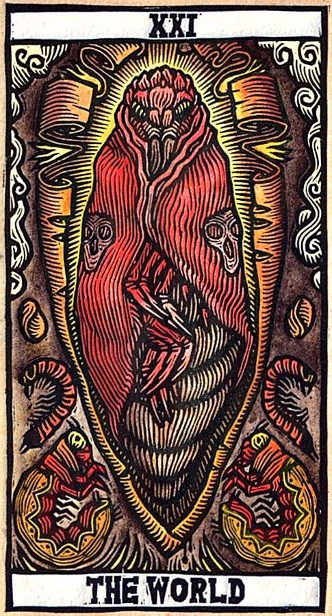
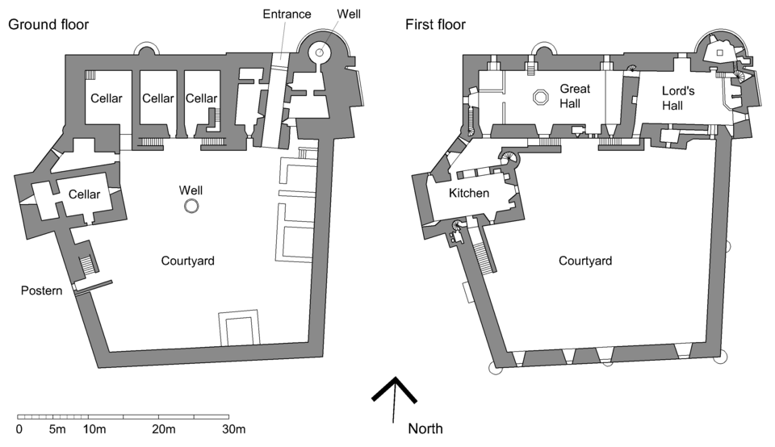

# 🍏 ギレルモ・デル・トロ監督映画作品でのパスワーキング
 
>このパスワーキングの使いかた 
>本書はギレルモ・デル・トロ作品の大アルカナをタペストリーとして観想し、世界（XXI）から愚者（0）へ、マルクトから32番の小径を通って上昇する伝統に従い進むパスワーキングの指示書である。各カードには映画タイトルと引用句が添えられており、それを禅の公案のように黙想し、理解できたと感じたら通過する。象徴を「獲得」するのではなく「剥がし、手放す」過程を重視するため、体験は個別的であり正解はない。短時間でも繰り返し取り組み、感じた像や感情を簡潔に記録することで、無意識からの気づきが深まり、多層の意味が開かれていく。

 
This page is maintained by ravensgate (KSC) a.k.a. Le Sorcier Inconnu.</vr> 
著者のKSCこと「知られざる呪術師」は ドロレス・アッシュクロフト=ノーウィッキから直接第３位界のイニシエーションを受け ダイアン・フォーチュンから続く法脈を受け取っている。

---

## 世界 XXI

 

 

**映画**: *The Mimic*  
**キャラクター／場面**: Chrysalis が開き、蝶が飛び立つ瞬間  

**テキスト**:  
*"The butterfly does not look back upon its caterpillar self, either fondly or wishfully, it simply flies on."*  
— *The Mimic*  

**日本語訳**:  
「蝶は毛虫であった自分を、懐かしむことも惜しむこともなく、ただ飛び去る。」  

**指示**:  
このタペストリーの前で、この言葉を禅の公案のように黙想せよ。  
理解できたと感じたら、タペストリーを通過し、次へ進め。  

---

## 審判 XX

 

 

**映画**: *The Devil’s Backbone*  
**キャラクター／場面**: 幽霊が未来を告げる場面  

**テキスト**:  
*"This is what the beginning of the end of the world will look like."*  
— *The Devil’s Backbone*  

**日本語訳**:  
「これが世界の終わりの始まりの姿だ。」  

**指示**:  
このタペストリーの前で、この言葉を禅の公案のように黙想せよ。  
理解できたと感じたら、タペストリーを通過し、次へ進め。  

---

## 太陽 XIX

 

 

**映画**: *Pacific Rim*  
**キャラクター／場面**: Jaeger が光の中に立つ場面  

**テキスト**:  
*"Night is not an absence of light, but in fact, it is daylight that is a brief respite from the all-encompassing darkness…" *  
— *Pacific Rim*  

**日本語訳**:  
「夜は光の不在ではない。むしろ、昼こそが、すべてを覆う闇からのつかの間の休息なのだ。」  

**指示**:  
このタペストリーの前で、この言葉を禅の公案のように黙想せよ。  
理解できたと感じたら、タペストリーを通過し、次へ進め。  

---

## 月 XVIII

 

 

**映画**: *Pan’s Labyrinth*  
**キャラクター／場面**: 地下迷宮に差し込む月光  

**テキスト**:  
*"The world is a cruel place, and it will not be kind to you."*  

**日本語訳**:  
「世界は残酷であり、あなたに優しくはしてくれない。」  

**指示**:  
このタペストリーの前で、この言葉を禅の公案のように黙想せよ。  
理解できたと感じたら、タペストリーを通過し、次へ進め。  

---

## 星 XVII

 

 

**映画**: *Hellboy II: The Golden Army*  
**キャラクター／場面**: エルフが夜空を見上げる場面  

**テキスト**:  
*"In the absence of light, we are all the same."*  

**日本語訳**:  
「光のないところでは、私たちは皆同じだ。」  

**指示**:  
このタペストリーの前で、この言葉を禅の公案のように黙想せよ。  
理解できたと感じたら、タペストリーを通過し、次へ進め。  

---

## 塔 XVI

 

 

**映画**: *Crimson Peak*  
**キャラクター／場面**: 崩れ落ちる屋敷  

**テキスト**:  
*"The house breathes, it bleeds, and it remembers."*  

**日本語訳**:  
「この屋敷は息をし、血を流し、そして覚えている。」  

**指示**:  
このタペストリーの前で、この言葉を禅の公案のように黙想せよ。  
理解できたと感じたら、タペストリーを通過し、次へ進め。  

---

## 悪魔 XV

 

 

**映画**: *Hellboy*  
**キャラクター／場面**: 地獄の召喚シーン  

**テキスト**:  
*"What makes a man a man? It’s the choices he makes."*  

**日本語訳**:  
「人を人たらしめるものは何か？それは彼が下す選択だ。」  

**指示**:  
このタペストリーの前で、この言葉を禅の公案のように黙想せよ。  
理解できたと感じたら、タペストリーを通過し、次へ進め。  

---

## 節制 XIV

 

 

**映画**: *The Shape of Water*  
**キャラクター／場面**: 水槽の中の邂逅  

**テキスト**:  
*"Time is but a river, flowing from our past into our future."*  

**日本語訳**:  
「時とはただの川であり、過去から未来へと流れていく。」  

**指示**:  
このタペストリーの前で、この言葉を禅の公案のように黙想せよ。  
理解できたと感じたら、タペストリーを通過し、次へ進め。  

---

## 死 XIII

 

 

**映画**: *The Strain*  
**キャラクター／場面**: 吸血鬼の変貌  

**テキスト**:  
*"We all die. The goal isn’t to live forever, but to create something that will."*  

**日本語訳**:  
「私たちは皆死ぬ。目的は永遠に生きることではなく、永遠に残るものを創ることだ。」  

**指示**:  
このタペストリーの前で、この言葉を禅の公案のように黙想せよ。  
理解できたと感じたら、タペストリーを通過し、次へ進め。  

---

## 吊られた男 XII

 

 

**映画**: *Cronos*  
**キャラクター／場面**: 永遠の命を求めて吊られる  

**テキスト**:  
*"Sometimes to find the truth, you must invert your perspective."*  

**日本語訳**:  
「真実を見つけるためには、時に自らの視点を逆さにせねばならない。」  

**指示**:  
このタペストリーの前で、この言葉を禅の公案のように黙想せよ。  
理解できたと感じたら、タペストリーを通過し、次へ進め。  

---

## 正義 XI

 

 

**映画**: *Blade II*  
**キャラクター／場面**: 吸血鬼を裁く瞬間  

**テキスト**:  
*"Justice is blind, but it sees the truth of blood."*  

**日本語訳**:  
「正義は盲目である。だが血の真実を見抜く。」  

**指示**:  
このタペストリーの前で、この言葉を禅の公案のように黙想せよ。  
理解できたと感じたら、タペストリーを通過し、次へ進め。  

---

## 運命の輪 X

 

 

**映画**: *Pacific Rim*  
**キャラクター／場面**: 運命を賭けた出撃  

**テキスト**:  
*"The future is not written, but the wheel always turns."*  

**日本語訳**:  
「未来はまだ書かれていない。だが輪は常に回り続ける。」  

**指示**:  
このタペストリーの前で、この言葉を禅の公案のように黙想せよ。  
理解できたと感じたら、タペストリーを通過し、次へ進め。  

---

## 隠者 IX

 

 

**映画**: *Cronos*  
**キャラクター／場面**: 隠遁する老人  

**テキスト**:  
*"In solitude, we find the answers that the crowd obscures."*  

**日本語訳**:  
「孤独の中にこそ、大衆が覆い隠す答えがある。」  

**指示**:  
このタペストリーの前で、この言葉を禅の公案のように黙想せよ。  
理解できたと感じたら、タペストリーを通過し、次へ進め。  

---

## 力 VIII

 

 

**映画**: *Pan’s Labyrinth*  
**キャラクター／場面**: 少女が怪物に立ち向かう  

**テキスト**:  
*"True strength is not in force, but in the courage to face fear."*  

**日本語訳**:  
「真の力は暴力ではなく、恐怖に立ち向かう勇気にある。」  

**指示**:  
このタペストリーの前で、この言葉を禅の公案のように黙想せよ。  
理解できたと感じたら、タペストリーを通過し、次へ進め。  

---

## 戦車 VII

 

 

**映画**: *Pacific Rim*  
**キャラクター／場面**: Jaeger の出撃シーン  

**テキスト**:  
*"To pilot together is to surrender the self, and become more."*  

**日本語訳**:  
「共に操縦するとは、自我を明け渡し、より大きな存在となることだ。」  

**指示**:  
このタペストリーの前で、この言葉を禅の公案のように黙想せよ。  
理解できたと感じたら、タペストリーを通過し、次へ進め。  

---

## 恋人 VI

 

 

**映画**: *The Shape of Water*  
**キャラクター／場面**: 人間と異形の愛  

**テキスト**:  
*"We are only as human as our capacity to love."*  

**日本語訳**:  
「愛する能力こそが、人間であることの尺度だ。」  

**指示**:  
このタペストリーの前で、この言葉を禅の公案のように黙想せよ。  
理解できたと感じたら、タペストリーを通過し、次へ進め。  

---

## 法王 V

 

 

**映画**: *The Devil’s Backbone*  
**キャラクター／場面**: 学校での教え  

**テキスト**:  
*"Tradition binds us, but it also teaches us."*  

**日本語訳**:  
「伝統は私たちを縛る。しかし同時に教えてくれる。」  

**指示**:  
このタペストリーの前で、この言葉を禅の公案のように黙想せよ。  
理解できたと感じたら、タペストリーを通過し、次へ進め。  

---

## 皇帝 IV

 

 

**映画**: *Crimson Peak*  
**キャラクター／場面**: 屋敷の支配者  

**テキスト**:  
*"Power is a house built on fragile ground."*  

**日本語訳**:  
「権力とは脆い地盤の上に建てられた家である。」  

**指示**:  
このタペストリーの前で、この言葉を禅の公案のように黙想せよ。  
理解できたと感じたら、タペストリーを通過し、次へ進め。  

---

## 女帝 III

 

 

**映画**: *Pan’s Labyrinth*  
**キャラクター／場面**: 母と大地の象徴  

**テキスト**:  
*"Creation is both nurture and sacrifice."*  

**日本語訳**:  
「創造とは養育であると同時に犠牲でもある。」  

**指示**:  
このタペストリーの前で、この言葉を禅の公案のように黙想せよ。  
理解できたと感じたら、タペストリーを通過し、次へ進め。  

---

## 女教皇 II

 

 

**映画**: *Hellboy II*  
**キャラクター／場面**: 予言を語る者  

**テキスト**:  
*"The truth lies between the seen and the unseen."*  

**日本語訳**:  
「真実は、見えるものと見えないものの間にある。」  

**指示**:  
このタペストリーの前で、この言葉を禅の公案のように黙想せよ。  
理解できたと感じたら、タペストリーを通過し、次へ進め。  

---

## 魔術師 I

 

 

**映画**: *Cronos*  
**キャラクター／場面**: 装置を操る錬金術師  

**テキスト**:  
*"To command is to understand the hidden laws."*  

**日本語訳**:  
「支配するとは、隠された法則を理解することだ。」  

**指示**:  
このタペストリーの前で、この言葉を禅の公案のように黙想せよ。  
理解できたと感じたら、タペストリーを通過し、次へ進め。  

---

## 愚者 0

 

 

**映画**: *Pan’s Labyrinth*  
**キャラクター／場面**: 少女が未知へ踏み出す瞬間  

**テキスト**:  
*"To step into the unknown is to become free."*  

**日本語訳**:  
「未知へと踏み出すことが、自由になることだ。」  

**指示**:  
このタペストリーの前で、この言葉を禅の公案のように黙想せよ。  
理解できたと感じたら、タペストリーを通過し、次へ進め。  

---

## （資料1） ドゥーン城　『モンティ・パイソン・アンド・ホーリー・グレイル』（英: Monty Python and the Holy Grail）のロケ地

 
City / Kingdom landscape.

 

>画像出展：
>CC BY-SA 4.0
>File:Scotland-2016-Aerial-Doune Castle (and Castle keeper's cottage).jpg
>Created: 4 August 2016
>Uploaded: 10 September 2016
>Location: 56° 10′ 42.43″ N, 4° 2′ 52.94″ W

 
City / Kingdom landscape.

 

>画像出展：
>English: Ground and first floor plans of Doune Castle, near Stirling, Scotland.
>日付	2008年10月16日
>原典	Own work by uploader, based on plan in Simpson, W.D. "Doune Castle" Proceedings of the Society of Antiquaries of Scotland 72: 73-83
>作者	Jonathan Oldenbuck

---

こちらもご覧ください➡️[ディスコーディアン魔術アーカイブ](https://github.com/ravensgate-tux/Discordianism_ksc/blob/main/README.md)

---
© 2025 知られざる呪術師（Le Sorcier Inconnu）  
本ドキュメントは [Creative Commons BY-SA 4.0](https://creativecommons.org/licenses/by-sa/4.0/deed.ja) に基づき公開されています。

