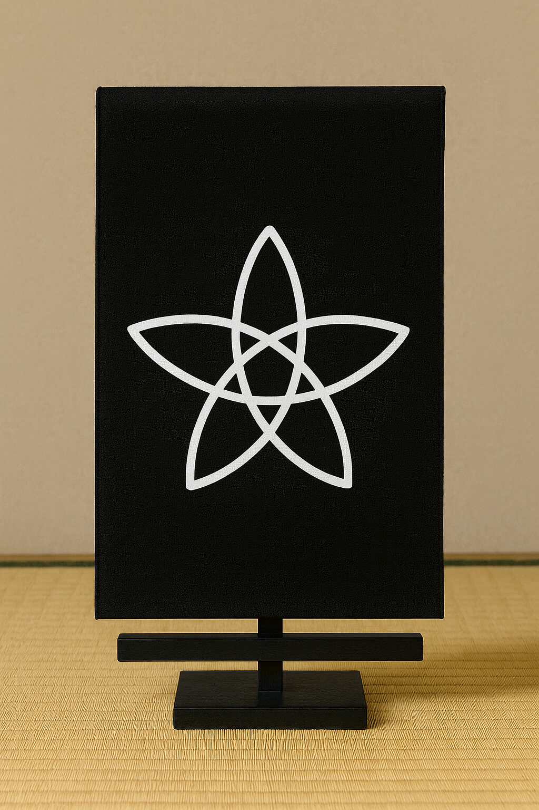

# 🍏 ディスコーディアン林檎観瞑想法（Apple Contemplation of Eris）

## 準備
1. 掛け軸を正面に設置し、Eris五芒星の背景に黄金の林檎を観想する。  
2. 静かに座し、背筋を伸ばし、呼吸を整える。  

 

## 観想手順
1. **入静**  
   鼻からゆっくり吸い、口からゆっくり吐く。3回繰り返し、混沌が静寂に溶け込むのを感じる。  
2. **林檎観**  
   掛け軸中央のEris五芒星の背景に黄金の林檎を観想する。  
   その中に刻まれた白いEris五芒星を、混沌の秩序／秩序の混沌の象徴として見つめる。  
3. **マントラ**  
   心の中で、あるいは小声で繰り返す：  
   *"Hail Eris, All Hail Discordia"*  
4. **同化**  
   自分自身が林檎となり、混沌と戯れる存在であると感じる。  
5. **回向**  
   「すべての出来事が笑いと驚きに満ちますように」と念じて終える。  

## 注意
- 笑い😂がこみ上げてきたら止めないこと。それも修行の一部である。  
- 特定の目的や結果を求めない。ただエリスの林檎🍏の中に在ること。

---
注意 
この観想法は、真言密教で行われる「月輪観」の構造を基盤に、Eris五芒星と黄金の林檎というディスコーディアン魔術の象徴を組み合わせたものである。
  
---

## こちらもご覧ください
[🍏ディスコーディアン魔術アーカイブ](https://github.com/ravensgate-tux/Discordianism_ksc/blob/main/README.md)

---
