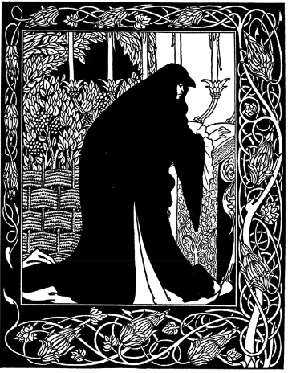

# 🍏 アーサー王象徴体系でのパスワーキング・ビアズリー挿絵版  (2025年9月版 v.01)  

 

 

>本書の使い方 ― パスワーキングのやり方
>
>本書は、アーサー王伝説を題材としたビアズリー挿絵を生命の樹の小径に対応させ、瞑想と象徴探究の実践に用いるための資料である。
>使用者は各挿絵を静かに凝視し、そこに描かれた人物・風景・物語の細部を心に刻むことから始める。
>十分に図像が心に定着した後、目を閉じてその場面に入り込み、登場人物と対話し、象徴的出来事を体験することによって内的な旅を進めるのである。
>
>パスワーキングは視覚化の訓練であり、同時に意識の変容を目的とする。
>重要なのは「象徴を正確に理解すること」ではなく、「象徴を通じて自己の無意識と交流すること」である。
>図像はそのための入口であり、道標である。実際の体験内容は人ごとに異なってよく、むしろ個別の体験を尊重することが肝要である。
>
>一度の瞑想で答えを得ようとせず、繰り返し同じ小径を歩むことで象徴は深まり、多層の意味が開かれていく。
>また、体験した内容を日誌に記録することが望ましい。言葉にすることで、無意識から受け取ったイメージが意識の財産へと昇華されるからである。

 
This page is maintained by ravensgate (KSC) a.k.a. Le Sorcier Inconnu.

---

### 0 愚者 

 
Merlin taketh the Child Arthur into his Keeping.

 

0 愚者 – Merlin taketh the Child Arthur into his Keeping（1078.png） 

あなたは草原に立ち、遠くに城の影を見ています。
そこへ老賢者マーリンが現れ、幼いアーサーを抱き上げます。
その光景を見つめるうちに、あなた自身がその子どもと重なります。
未知への旅立ち、守護者の導き、未来の可能性すべてがあなたの足もとに広がっています。
**愚者の径**として、あなたは何も持たず、それでいてすべてを抱えています。

---

 
The Lady of the Lake telleth Arthur of Excalibur.

 

I 魔術師 – The Lady of the Lake telleth Arthur of Excalibur（1122.png） 

湖の森に入り、ひときわ澄んだ泉のほとりに立ちます。
湖の乙女があなたに近づき、銀の剣を示します。
マーリンが静かに見守る中、その剣の重さと力が掌に伝わります。
それは単なる武器ではなく、意志を具現化する道具。
あなたの言葉と行為を通じて、世界を変える「技法」が目覚めていきます。
**魔術師の径**として、あなたは自らの力を初めて自覚します。

---

 
Lady reading in orchard.

 

II 女司祭 – Lady reading in orchard (2147.png) 

果樹園の奥、白い衣の女性が静かに書を読んでいます。
あなたは近づき、彼女の背後から頁を覗きますが、文字は光に溶け、意味を越えて漂います。
やがて彼女は顔を上げ、あなたに目を合わせます。
言葉はなく、ただ沈黙の叡智が胸の奥に降りてきます。
それは直感、夢、深層に潜む記憶。
**女司祭の径**として、あなたは知の門の前に立ち、内なる声に耳を澄ませます。

---

 
Woman in orchard with rich mantle.

 

III 女帝 – Woman in orchard with rich mantle（2146.png） 

緑豊かな果樹園に入ると、一人の女性が絹のマントを羽織り、木々の間に立っています。
その足もとには花々が咲き乱れ、果実の香りが漂います。
彼女はあなたに手を差し伸べ、実をひとつ渡します。
それを口にすると、甘さと滋養が全身に広がり、生命力が目覚めます。
**女帝の径**として、この象徴は自然の豊かさ、育み、そして愛をあなたに授けます。

---

 
How Morgan le Fay gave a Shield to Sir Tristram.

 

IV 皇帝 – How Morgan le Fay gave a Shield to Sir Tristram（1542.png） 

石造りの広間に入り、荘厳な静けさの中に立ちます。
モルガン・ル・フェイが黄金の盾を掲げ、あなたの前に差し出します。
その紋章は光を反射し、威厳と秩序の象徴となっています。
盾を受け取ると、あなたの背筋は伸び、大地と天が一直線につながる感覚を得ます。
**皇帝の径**として、この象徴は権威と秩序の力をもって、あなたを現実の守護者へと鍛えます。

---

 
Monk reading in chapel.

 

V 教皇 – Monk reading in chapel（2584.png） 

静かな礼拝堂に入ると、一本の燭台が祭壇を照らしています。
僧衣の人物が古い書を朗々と読み上げています。
その声はやがてあなたの胸の奥に共鳴し、言葉を越えた聖なる響きとなります。
見えない師が背後に立ち、あなたを古来から続く知恵の流れへと導きます。
**教皇の径**として、この象徴は伝統と霊性を媒介し、あなたを大いなる系譜の一員として結びます。

---

 
Monk reading in chapel.

 

VI 恋人 – How Sir Tristram drank of the Love Drink（1420.png） 

船の甲板の上、あなたは杯を手渡されます。
赤い液体が揺れ、芳しい香りが立ちのぼります。
それを口にすると、炎のような熱が体を駆け抜け、目の前の相手と魂が絡み合います。
これは選択ではなく、すでに定められた縁。
愛は歓びと苦悩を同時に約束します。
**恋人の径**として、この象徴は結合と宿命を映し出します。

---

 
Monk reading in chapel.

 

VII 戦車 – Two knights riding through forest（2071.png） 

深い森の中で、二頭の馬が道を駆け抜けます。
その背には騎士たちが並び、槍と盾を掲げています。
あなたはその行列に加わり、力強く手綱を握ります。
前進する意志が胸に燃え、左右に揺れる馬も完全に統御されます。
**戦車の径**として、この象徴は勝利の推進力をもたらします。

---

 
Sir Launcelot and the Witch Hellawes.

 

VIII 力 – Sir Launcelot and the Witch Hellawes（1294.png） 

夜の館に入り、薄暗い光の中で魔女が迫ります。
甘い言葉、妖しい魅惑、その力に心が揺らぎます。
だがあなたは眼差しを正し、己の中心を守ります。
欲望を抑えるのではなく、受け止めて変容させる。
**力の径**として、この象徴は獣性を抱きしめた上での内なる剛毅を示します。

---

 
How La Beale Isoud wrote to Sir Tristram.

 

IX 隠者 – How La Beale Isoud wrote to Sir Tristram（1472.png） 

月明かりに照らされた小部屋で、女性が机に向かい手紙を書いています。
静けさの中、インクの匂いと羽根ペンの音だけが響きます。
あなたは背後から見守り、孤独に込められた深い思いを感じます。
そこには愛と痛み、そして魂の探求が刻まれています。
**隠者の径**として、この象徴は孤独の中での智慧を授けます。

---

 
Three women in orchard.

 

X 運命の輪 – Three women in orchard（2246.png）
果樹園に入ると、三人の女性が輪になって立っています。
一人は未来を語り、一人は過去を紡ぎ、もう一人は現在を見つめています。
あなたはその円の中央に導かれ、三方向から同時に視線を受けます。
時間が溶け合い、運命の織物が織られていくのを体感します。
**運命の輪の径**として、この象徴は永遠の巡りと変転を示します。

---

 
Arthur and the Strange Mantle.

 

XI 正義 – Arthur and the Strange Mantle（1210.png） 

石の広間に立つと、豪奢なマントが差し出されます。
それを身にまとうと、重さが心の奥にまで響き、真実を試されていると知ります。
観衆の視線は鋭く、隠すものはすべて暴かれます。
逃げずに立つと、マントは次第に軽くなり、均衡の力が全身を貫きます。
**正義の径**として、この象徴は秤のごとき裁きを体験させます。

---

 
Merlin and Nimue.

 

XII 吊られた男 – Merlin and Nimue（1182.png） 

古い森の奥、泉のほとりでマーリンは美しいニムエに見入っています。
その魅惑の眼差しに捕らえられ、彼は身動きできません。
時間は停止し、あなたもまた空中に逆さに吊られる感覚を覚えます。
受動と受容、抵抗できぬ力の中で、新しい視点が開けます。
**吊られた男の径**として、この象徴は逆転と献身の智慧を与えます。

---

 
How King Marke found Sir Tristram.

 

XIII 死 – How King Marke found Sir Tristram（1494.png） 

暗い森で王が踏み込み、隠されていた二人を発見します。
その瞬間、愛の物語は終焉を迎え、避けられぬ別離が訪れます。
あなたはその光景に立ち会い、心の奥に「終わり」を受け入れる痛みを覚えます。
だが同時に、新しい始まりの気配が芽吹いているのを感じます。
**死の径**として、この象徴は破局を通じた変容を示します。

---

 
How La Beale Isoud nursed Sir Tristram.

 

XIV 節制（1）– How La Beale Isoud nursed Sir Tristram（1390.png）
薄暗い部屋でトリスタンは傷つき横たわっています。
イゾルデが静かに近づき、手で水をすくい、その額に触れます。
その仕草は炎を鎮め、痛みを溶かし、調和をもたらします。
あなたもまたその癒しを受け、心身の乱れが整えられていくのを感じます。
**節制の径 – 静**として、この象徴は回復と均衡を授けます。

 
Lovers in the forest.

 

XIV 節制（2）– Lovers in the forest（2247.png）
森の奥、緑の枝葉が天蓋のように覆っています。
二人の恋人が出会い、互いに手を取り合う姿が見えます。
その瞬間、炎と水のように異なるものが混じり合い、新しい調和が生まれます。
あなたはその場に立ち会い、自身の中の対立が一つに結ばれるのを知ります。
**節制の径 – 動**として、この象徴は融合と変容を授けます。

---

 
How a devil in woman’s likeness tempted Sir Bors.

 

XV 悪魔 – How a devil in woman’s likeness tempted Sir Bors（2368.png） 

暗い館の中で、妖艶な女の姿をした悪魔が近づきます。
微笑み、手を差し伸べ、あなたを甘美な鎖で縛ろうとします。
その誘惑に抗うか、屈するかはあなた次第です。
鎖は外からではなく内から生まれていると気づいた時、解放の力が芽生えます。
**悪魔の径**として、この象徴は欲望と自由の境界を示します。

---

 
Maidens in the Tower.

 

XVI 塔 – Maidens in the Tower（2369.png） 

高くそびえる塔の上から、乙女たちが下界を見下ろしています。
そこにはまだ崩壊の兆しはありませんが、空気は緊張に満ちています。
あなたはその場に立ち、塔の石壁が内側からひび割れていく感覚を覚えます。
驕りと安定への執着は、やがて必ず崩れることを悟ります。
**塔の径**として、この象徴は破壊と解放の前兆を示します。

---

 
Knight resting by hillside.

 

XVII 星 – Knight resting by hillside（2070.png） 

丘の中腹、疲れた騎士が鎧を解き、静かに休んでいます。
夜空には星が輝き、冷たい風が頬を撫でます。
あなたはその隣に座り、遠い未来への希望を思い描きます。
水のせせらぎが聞こえ、魂は静けさのうちに再生します。
**星の径**として、この象徴は希望と更新を授けます。

---

 
How Four Queens found Lancelot sleeping.

 

XVIII 月 – How Four Queens found Lancelot sleeping（1264.png） 

夜の森に足を踏み入れると、霧の中に一人の騎士が眠っています。
その周囲を四人の女王が取り囲み、囁きながら彼を見下ろしています。
あなたもまたその夢に入り込み、現実と幻想の境界が曖昧になります。
月の光が影を長く伸ばし、無意識の海に沈むような感覚。
**月の径**として、この象徴は幻惑と直感の領域を開きます。

---

 
How Queen Guenevere rode on Maying.

 

XIX 太陽 – How Queen Guenevere rode on Maying（2484.png） 

春の朝、花に飾られた行列が陽光の下を進みます。
女王グィネヴィアが白馬に乗り、民は歓声をあげます。
あなたはその列に加わり、全身を太陽が照らし、生命の喜びが胸に満ちます。
笑い声と歌声は境界を越え、あらゆるものと一体になる感覚をもたらします。
**太陽の径**として、この象徴は顕現と歓喜を授けます。

---

 
Sword rising from lake, knight salutes.

 

XX 審判 – Sword rising from lake, knight salutes（2574.png） 

湖の水面が揺れ、やがて光に包まれた剣がせり上がります。
騎士はひざまずき、剣に敬礼します。
あなたもその場に立ち会い、胸の奥から響く召命の声を聞きます。
それは過去の眠りを破り、あなたを新しい段階へと呼び覚まします。
**審判の径**として、この象徴は再生と覚醒の力を授けます。

---

 
City / Kingdom landscape.

 

XXI 世界 – City / Kingdom landscape（2489.png）

高い丘の上に立ち、眼下に広がる王国を見渡します。
城壁、塔、川、そして遠い山々。すべてが一つの調和の中にあります。
あなたはその中心に立ち、世界と自分が区別できなくなります。
完成と統合、巡りの終わりと新しい始まり。
**世界の径**として、この象徴は宇宙的な全体性を体験させます。

---

## （資料1） 22小径 対応表（節制は2枚）

| 大アルカナ | 文字 | パス位置 | ファイルID | 備考 |
|---|---|---|---|---|
| 0 愚者 | א Aleph | ケテル⇄ホクマー | **Merlin taketh the Child Arthur into his Keeping (1078)** | 旅立ち・新生 |
| I 魔術師 | ב Beth | ケテル⇄ビナー | **The Lady of the Lake telleth Arthur of Excalibur (1122)** | 技と意志の始まり |
| II 女司祭 | ג Gimel | ケテル⇄ティファレト | **Lady reading in orchard (2147)** | 沈黙・奥義 |
| III 女帝 | ד Daleth | コクマー⇄ビナー | **Woman in orchard with rich mantle (2146)** | 豊饒・育成 |
| IV 皇帝 | ה Heh | コクマー⇄ティファレト | **How Morgan le Fay gave a Shield to Sir Tristram (1542)** | 権威・武徳 |
| V 教皇 | ו Vav | ケセド⇄ホクマー | **Monk reading in chapel (2584)** | 伝統・祭儀 |
| VI 恋人 | ז Zayin | ビナー⇄ティファレト | **How Sir Tristram drank of the Love Drink (1420)** | 結合・選択 |
| VII 戦車 | ח Cheth | ゲブラー⇄ビナー | **Two knights riding through forest (2071)** | 前進・統御 |
| VIII 力 | ט Teth | ゲブラー⇄ティファレト | **Sir Launcelot and the Witch Hellawes (1294)** | 誘惑と剛毅 |
| IX 隠者 | י Yod | ケセド⇄ティファレト | **How La Beale Isoud wrote to Sir Tristram (1472)** | 内観・孤高 |
| X 運命の輪 | כ Kaph | ケセド⇄ネツァク | **Three women in orchard (2246)** | 巡り・分岐 |
| XI 正義 | ל Lamed | ゲブラー⇄ティファレト | **Arthur and the Strange Mantle (1210)** | 裁き・均衡 |
| XII 吊られた男 | מ Mem | ゲブラー⇄ホド | **Merlin and Nimue (1182)** | 魅惑・拘束 |
| XIII 死 | נ Nun | ティファレト⇄ネツァク | **How King Marke found Sir Tristram (1494)** | 終焉・変容 |
| XIV 節制（1） | ס Samekh | イェソド⇄ティファレト | **How La Beale Isoud nursed Sir Tristram (1390)** | 静的均衡（癒し） |
| XIV 節制（2） | ס Samekh | イェソド⇄ティファレト | **Lovers in the forest (2247)** | 動的混合（合一） |
| XV 悪魔 | ע Ayin | ティファレト⇄ホド | **How a devil in woman’s likeness tempted Sir Bors (2368)** | 隷属・執着 |
| XVI 塔 | פ Peh | ネツァク⇄ホド | **Maidens in the Tower (2369)** | 崩壊の前兆 |
| XVII 星 | צ Tzaddi | ネツァク⇄イェソド | **Knight resting by hillside (2070)** | 希望・更新 |
| XVIII 月 | ק Qoph | ネツァク⇄マルクト | **How Four Queens found Lancelot sleeping (1264)** | 夢・幻惑 |
| XIX 太陽 | ר Resh | ホド⇄イェソド | **How Queen Guenevere rode on Maying (2484)** | 祝祭・顕現 |
| XX 審判 | ש Shin | ホド⇄マルクト | **Sword rising from lake, knight salutes (2574)** | 召命・再起 |
| XXI 世界 | ת Tav | イェソド⇄マルクト | **City / Kingdom landscape (2489)** | 完成・統合 |

---

## （資料2） ドゥーン城　『モンティ・パイソン・アンド・ホーリー・グレイル』（英: Monty Python and the Holy Grail）のロケ地

 
City / Kingdom landscape.

 

>画像出展：
>CC BY-SA 4.0
>File:Scotland-2016-Aerial-Doune Castle (and Castle keeper's cottage).jpg
>Created: 4 August 2016
>Uploaded: 10 September 2016
>Location: 56° 10′ 42.43″ N, 4° 2′ 52.94″ W

 
City / Kingdom landscape.

 

>画像出展：
>English: Ground and first floor plans of Doune Castle, near Stirling, Scotland.
>日付	2008年10月16日
>原典	Own work by uploader, based on plan in Simpson, W.D. "Doune Castle" Proceedings of the Society of Antiquaries of Scotland 72: 73-83
>作者	Jonathan Oldenbuck

---
© 2025 知られざる呪術師（Le Sorcier Inconnu）  
本ドキュメントは [Creative Commons BY-SA 4.0](https://creativecommons.org/licenses/by-sa/4.0/deed.ja) に基づき公開されています。
