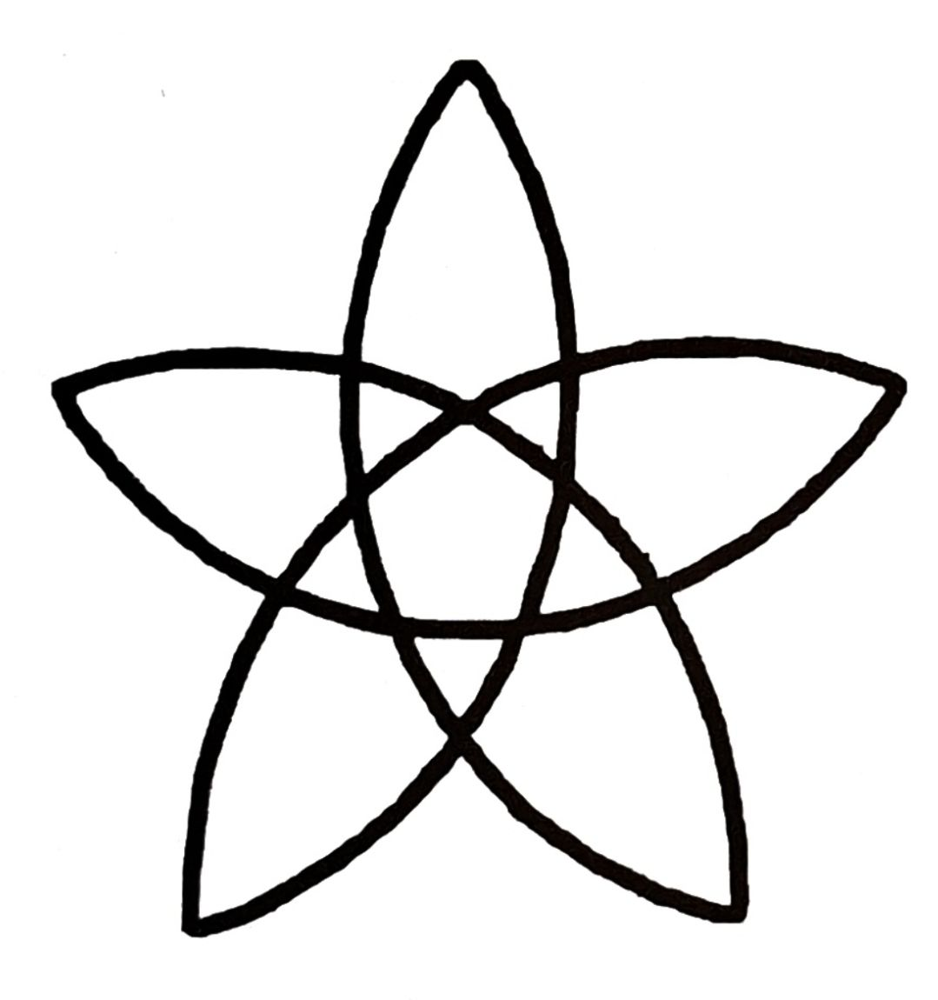

# RITUAL: INVOKING ERIS
To be performed during times of stagnation, rigidity, or when sacred disruption is needed.

## 🕯️ PART 1: OPENING
Light candles. Prepare the altar with symbols of Eris — golden apple, spiral, or the number 23.
With your chosen tool — wand, athame, or ego-hammer — trace the opening Eris Pentacle in the air or upon the altar.

 

LADY OF THE GOLDEN APPLE,  
MISTRESS OF THE DISCORDANT TRUTH,  
BEAUTIFUL ENEMY OF FALSE HARMONY,  
I OPEN THIS SPACE IN YOUR HONOR.  
LET LAUGHTER AND CHAOS ENTER HERE.

(Clap once. Light incense or peppermint oil.)

## 🍎 PART 2: INVOCATION OF ERIS
DISCORDIA INTRAT. ORDO EXEAT.  
Clap once. Laugh once.  
ALL THAT IS TOO CERTAIN, BE SHAKEN.  
ALL THAT IS TOO ORDERED, BE SPUN.

**Banishment of False Order:**  
DOGMAS THAT CHAIN MY THOUGHT — I MOCK YOU.  
PATTERNS THAT CAGE POSSIBILITY — I UNWEAVE YOU.  
I OPEN THE GATES OF THE UNKNOWN!

ANOIKTOI AI PYLAI TÊS ATAKSIAS! *(Open the pylons of chaos!)*  
ANOIKTOI AI PYLAI TÔN GELÔN! *(Open the pylons of laughter!)*

**Calling to Eris:**  
LADY OF THE GOLDEN APPLE,  
BRINGER OF THE NEEDED MISTAKE,  
GRANT ME THE PLEASURE OF YOUR INTERVENTION  
AND THE DELIGHT OF YOUR TROUBLE.

**Petition (speak freely or chaotically):**  
LET POSSIBILITY BE SHUFFLED.  
LET FATE BE DARED.  
LET ME BE UNFIXED, THAT I MAY GROW.  
SPIN ME INTO A BETTER MESS.

**Mantra (repeat irregularly, with shifting tone):**  
IO ERIS IO HA!  
IO ERIS KAOS MA!  
IO IO ERIS!

(Include laughter, spontaneous words, off-rhythm clapping, or movement.)

**Offerings:**  
- Golden apple (physical or symbolic)  
- Small strange items (toys, charms, errors)  
- Peppermint oil, chocolate, scribbled notes  

## 🌀 PART 3: GRATITUDE TO ERIS
I THANK YOU, ERIS, FOR YOUR INTERVENTION.  
FOR THE JOKE I NEEDED, AND THE MISTAKE THAT FREED ME.  
MAY YOU WALK LAUGHING BACK TO THE GOLDEN APPLEFIELDS.  
HAIL ERIS.  
DISCORDIA RECEDAT.

With your chosen tool — wand, athame, or ego-hammer — trace the closing Eris Pentacle in the air or upon the altar.

 

(Clap once. Extinguish incense or oil. Let the candles burn or gently dim.)

**RITUAL COMPLETE.**

---

## 📋 License
© 2025 知られざる呪術師（Le Sorcier Inconnu）  
本ドキュメントは Creative Commons BY-SA 4.0 に基づき公開されています。
