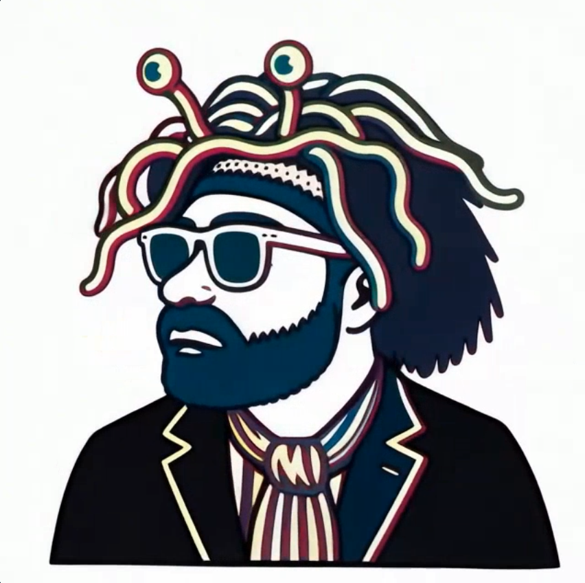
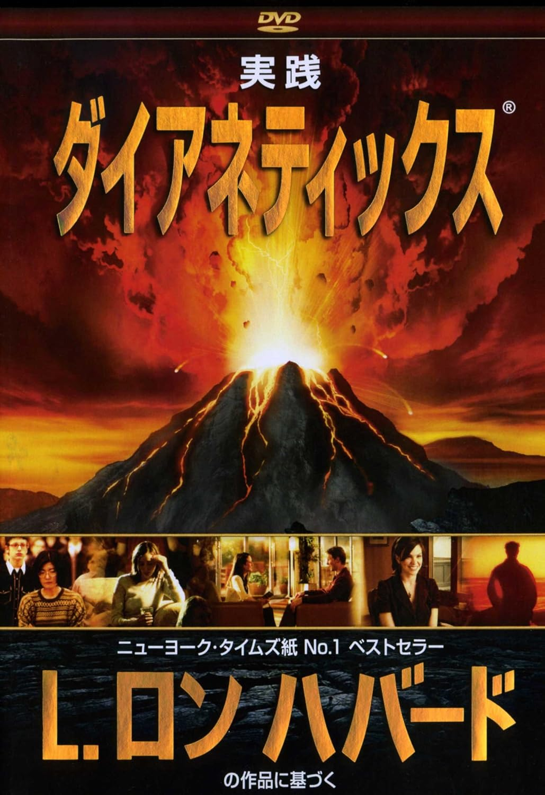

# 🧠 シャーウィンのエングラム魔術
**― レイ・シャーウィン『The Book of Results』におけるダイアネティックス的無意識操作 ―**  

 
This page is maintained by ravensgate (KSC) a.k.a. Le Sorcier Inconnu.</vr> 
著者のKSCこと「知られざる呪術師」は ドロレス・アッシュクロフト=ノーウィッキから直接第３位界のイニシエーションを受け ダイアン・フォーチュンから続く法脈を受け継いでいる。

---

## 🔹 1. 前提（Context）

本書は、レイ・シャーウィン *『The Book of Results』（1978）* における、  
ダイアネティックス（L・ロン・ハバード）の心のモデル――  
**分析心（Analytic Mind）・反応心（Reactive Mind）・エングラム（Engram）**――を参照し、  
彼がオースティン・オスマン・スペアのシジル魔術を  
どのように心理学的構造として再構築したかを考察するものである。  

ここでの目的は、ハバードが「除去すべき障害」としたエングラムを、  
意図的に生成し利用する“創造的エングラム（magical engram）”として再定義することにある。  

---

## 🔹 2. ダイアネティックスにおける定義

 

   [画像出典（Amazon.co.jp）](https://www.amazon.co.jp/dp/4931223273?ref_=ppx_hzod_title_dt_b_fed_asin_title_0_0)

 

| 用語 | ダイアネティックスでの定義 | 役割 |
|------|----------------------|------|
| **分析心（Analytic Mind）** | 感覚情報を正しく処理し、論理的判断を行う意識的領域。 | 健全な思考・推論・判断を担う。 |
| **反応心（Reactive Mind）** | 無意識下で痛み・恐怖・失神などの瞬間に記録された体験（エングラム）を、無批判に保存する領域。 | 自動的反応の原因。 |
| **エングラム（Engram）** | 無意識状態における五感・感情・言葉などの完全記録。後に類似刺激で再活性化し、情動反応を引き起こす。 | トラウマ・行動異常の根源。 |

> ハバードにとってエングラムは「悪性データ」であり、  
> オーディティング（監査）によって再体験・浄化（クリアリング）し、  
> 除去することが治療の目的であった。

---

## 🔹 3. シャーウィンによる再定義

シャーウィンは『The Book of Results』第2章において、  
この心的モデルを**魔術の作動原理の説明装置**として導入している。  

彼は、感情と無意識の関係をこう説明する：

> 「魔術とは感情を扱うものであり、儀式とは無意識（自己誘発的かつ制御されたもの）を扱うものである。  
>  どちらの状態でも分析心は停止し、データが反応心に受け入れられる。」  
>  *(Ray Sherwin, The Book of Results)*

そのうえで、  
**偶発的なトラウマによるエングラム＝否定的なシジル、  
意図的に形成されたシジル＝肯定的なエングラム**  
とみなし、**トラウマ構造を逆利用する魔術**を提示した。

 

つまり、ダイアネティックスがエングラムを「取り除くべき障害」として扱い、  
オーディティングによって消去することしか試みなかったのに対し、  
シャーウィンはその仕組み自体をハッキングし、  
エングラムを自らの望む方向へ積極的に利用しようとした点において異なる。  

---

## 🔹 4. エングラムの二分法

| 種類 | 形成条件 | 結果 | 例 |
|------|-----------|------|----|
| **悪性エングラム（Negative Engram）** | 恐怖・痛み・ショック・無意識下で偶発的に記録される。 | 無意識的トラウマ、行動の歪み。 | 事故・暴力・失神・病的恐怖。 |
| **創造的エングラム（Positive Engram）** | 制御された無意識状態（ノーシス）で意図的に刻印される。 | 願望実現・心理的再構築。 | シジル魔術、儀式的トランス。 |

> 「事故は偶発的なエングラムを作る。  
> 儀式はそれを意図的に作る。」  
>  — レイ・シャーウィン

---

## 🔹 5. メカニズム（Mechanism）

1. **意図の設定（Intention）**  
   願望を短い命題に凝縮し、文字・図形などに変換（シジル化）  
2. **分析心の停止（Shutdown of Analytic Mind）**  
   ノーシス状態（性的興奮、強い集中、瞑想、回転、過呼吸など）によって意識を遮断  
3. **反応心への刻印（Imprinting to Reactive Mind）**  
   シジルを象徴的命令文として、感情の高まりとともに反応心へ記録  
4. **忘却と再刺激（Forgetting & Re-Stimulation）**  
   意識的に忘れることで検閲を回避し、後に外界の刺激やシンクロニシティを通して顕現する  

---

## 🔹 6. ダイアネティックスとの比較

| 観点 | ダイアネティックス | シャーウィンの魔術 |
|------|----------------|----------------|
| 目的 | 無意識的記録の除去（治療） | 意識的記録の生成（創造） |
| 手法 | オーディティング（再体験・浄化） | シジル＋ノーシス（意図的書き込み） |
| 無意識の扱い | 浄化対象 | 操作対象 |
| 結果 | 「クリア」＝空白の心 | 「プログラム済み」＝創造的無意識 |
| 操作者 | オーディター（他者） | マジシャン（自己） |

---

## 🔹 7. シャーウィン的操作の特徴

- **治療ではなく創造：**  
  ハバードが「削除」を目的としたのに対し、シャーウィンは「生成」を目的とする。  
- **受動から能動へ：**  
  無意識に刻まれる「被験者」から、無意識に刻む「操作者」へ。  
- **安全なトラウマ模倣：**  
  痛みや恐怖ではなく、制御された強度（快・陶酔・集中）で意識を越える。  
- **感情エネルギーの変換：**  
  トラウマ的力動を創造的エネルギーとして再利用する。  

---

## 🔹 8. 実践モデル（Practical Framework）

1. 願望を簡潔に言語化し、シジルへ変換する
2. 制御された環境（儀式・トランス・集中法）を整える
3. 呼吸・リズム・感覚集中などにより分析心を停止させる
4. 感情の高まりと共にシジルを想起し、無意識に刻印する
5. 儀式を終え、意図を意識的に忘却する
6. 日常の中でシンクロニシティや現実変化を観察する

---

## 🔹 9. 理論的意義（Theoretical Implications）

シャーウィンの「エングラム魔術」は、  
ダイアネティックスの“治療モデル”を“創造モデル”へと転換した試みである。  

彼にとって魔術とは、過去の傷を癒す行為ではなく、  
**無意識に未来をプログラムする行為**である。  

偶発的トラウマの仕組みを逆転させ、  
**自らの反応心を意図的記憶媒体として設計・再利用する**という思想は、  
スペア的アート・マジックとサイコロジカル・エンジニアリングの統合点に位置する。

---

## 🔹 10. 参考文献（References）

- Ray Sherwin, *The Book of Results*, 1978.  
- L. Ron Hubbard, *Dianetics: The Modern Science of Mental Health*, 1950.  
- Austin Osman Spare, *The Book of Pleasure (Self-Love): The Psychology of Ecstasy*, 1913.  
- Christopher Evans, *Cults of Unreason*, Panther Books, 1973.  

---

## 🔹 11. ライセンス（License）

本ドキュメントは **Creative Commons Attribution 4.0 International (CC BY 4.0)** のもとで公開されています。  

© 2025  
  

---

### 📎 関連リンク

こちらもご覧ください➡️[ディスコーディアン魔術アーカイブ](https://github.com/ravensgate-tux/Discordianism_ksc/blob/main/README.md)

---

© 2025 知られざる呪術師（Le Sorcier Inconnu）  
本ドキュメントは [Creative Commons BY-SA 4.0](https://creativecommons.org/licenses/by-sa/4.0/deed.ja) に基づき公開されています。

