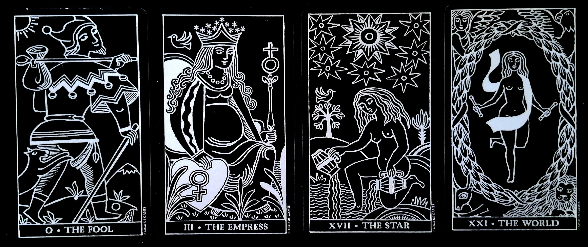

# 🍏 タロット・タリスマンの手順書（改）

本手順書は、チック・シセロ & サンドラ・シセロ夫妻による『タロット・タリスマン』のスプレッドを参考にしつつ、独自に改造したものです。  
オリジナルでは三角形＋中央の配置を用いますが、本改造版ではカードを横一列に並べる方式を採用しています。

---

## 手順概要

1. **タロットを選ぶ**  
   - テーマ（例：転職成功、収入アップ）に沿って 4 枚を選出。  
   - 役割は以下の通り：  
     1. 対象者（自分自身）  
     2. 初動  
     3. 進行  
     4. 結果  

2. **ストーリーを構築する**  
   - 各カードの象徴をもとに「召喚のストーリー」を 4 段階で組み立てる。  
   - 例：  
     - 1 → 「私は新しい旅へ踏み出す」  
     - 2 → 「可能性を育み、実りを生み出す」  
     - 3 → 「希望と導きを受けて進む」  
     - 4 → 「新天地で成功し、完成を得る」  

3. **カードを配置する**  
   - 横一列に 1〜4 を並べる。  
   - （オリジナルのシセロ夫妻版は三角形＋中央配置）

4. **記録とチャージ**  
   - 並べた状態を写真に撮る。  
   - その写真を紙に印刷する。  
   - 印刷した紙を **本棚神殿** に一定期間安置し、象徴的なチャージを行う。  

5. **儀式的廃棄と忘却**  
   - チャージを終えた紙は、以下いずれかの方法で処分する：  
     - 火で燃やす  
     - 塩を含ませて廃棄する  
   - 最後に「忘却」を行い、意識から切り離す。  

---

## 流れの図示（改造版）

```
[1] [2] [3] [4]
```

---
## 使用例 （転職の成功）

対象者：<br> 愚者（0） → 「新しい旅立ち」
初動：<br> 女帝（III） → 豊かな可能性を育む
進行：<br> 星（XVII） → 希望・導きの象徴。未来志向
結果：<br> 世界（XXI） → 「完成」「新天地での成功」

<div align="center">

</div>

---

## 備考

- 本手順はオリジナルの「タロット・タリスマン」から着想を得た改造版であり、独自の実践法です。  
- 実施にあたっては個々人の象徴解釈に基づいて自由に応用してください。  
